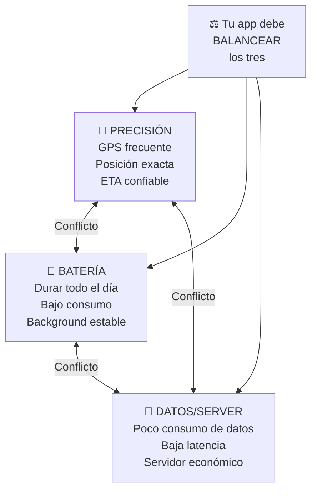
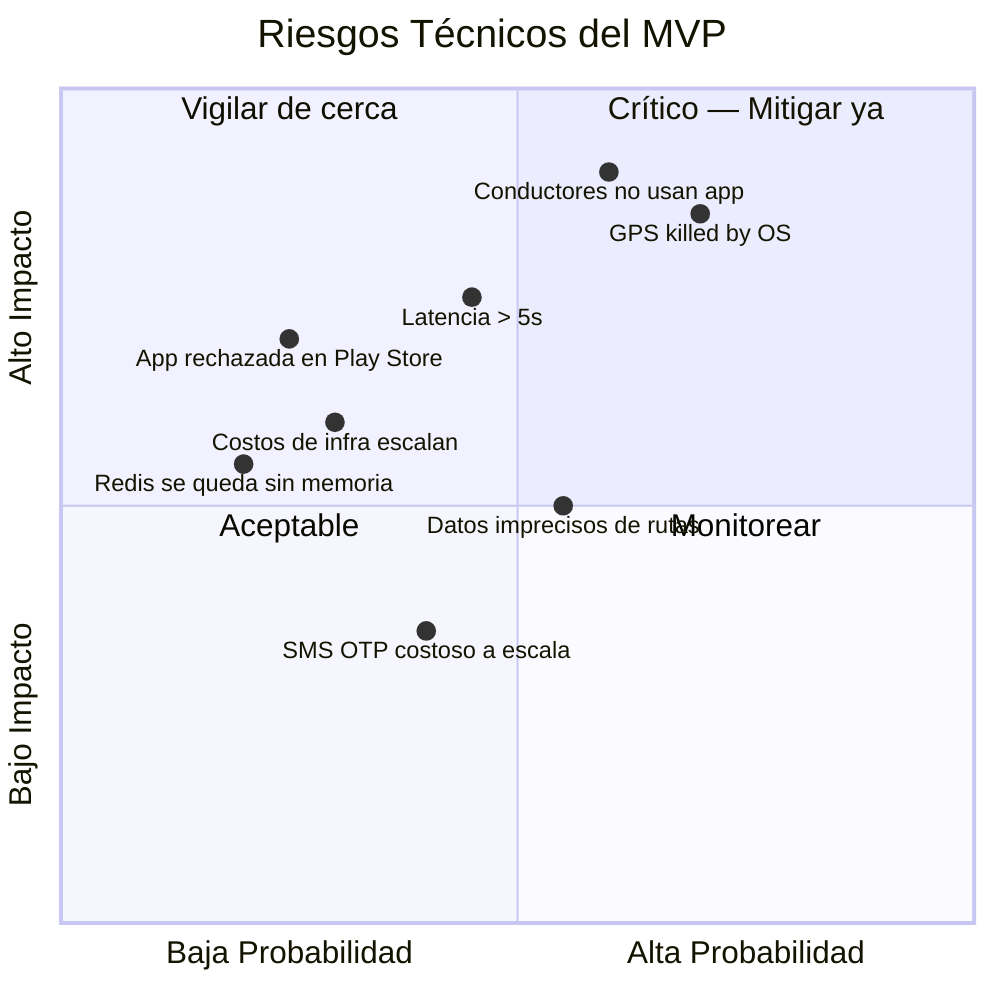

# 🎯 Análisis de Complejidad — App Buses Managua

## Veredicto de Complejidad

```
┌─────────────────────────────────────────────────────────┐
│                                                         │
│   COMPLEJIDAD GENERAL:  7.2 / 10  —  MEDIO-ALTO        │
│                                                         │
│   ██████████████████████████████████░░░░░░░░░░░░░░░░░   │
│                                                         │
│   No es un CRUD, pero tampoco es construir un Uber.     │
│   Es un proyecto ambicioso pero viable para un equipo   │
│   de 2 devs + herramientas de IA.                       │
│                                                         │
└─────────────────────────────────────────────────────────┘
```

> [!IMPORTANT]
> La dificultad **no está en ningún componente individual** (hay miles de tutoriales para cada pieza). La dificultad está en que **todos los componentes deben funcionar en armonía y en tiempo real**, bajo condiciones adversas (conectividad pobre, batería limitada, datos caros).

---

## 1. Scorecard de Complejidad por Dimensión

| # | Dimensión | Puntuación | Peso | Ponderado | Justificación |
|:--|:---|:---:|:---:|:---:|:---|
| 1 | **Tiempo real (WebSocket/GPS)** | 🔴 8/10 | 15% | 1.20 | El corazón de la app. GPS continuo → Redis → broadcast a N clientes. Cada segundo cuenta |
| 2 | **GPS en background (mobile)** | 🔴 8/10 | 12% | 0.96 | Android Doze mode, restricciones de batería del OS, mantener tracking estable sin que el sistema lo mate |
| 3 | **Optimización batería/datos** | 🟡 7/10 | 10% | 0.70 | Distance filter, batching, compresión, sensor fusion. No es trivial hacerlo bien |
| 4 | **Geoespacial (PostGIS/mapas)** | 🟡 6/10 | 10% | 0.60 | Queries espaciales, map-matching, cálculo de distancia en ruta. PostGIS ayuda mucho pero hay curva de aprendizaje |
| 5 | **Algoritmo ETA** | 🟡 6/10 | 8% | 0.48 | Versión MVP (promedio histórico) es manejable. La complejidad crece si se quiere ML después |
| 6 | **Modo offline + sync** | 🟡 7/10 | 8% | 0.56 | Cache de tiles, buffer de GPS, reconciliación de datos. Muchos edge cases |
| 7 | **Infraestructura (Redis + PG + WS)** | 🟡 6/10 | 8% | 0.48 | Múltiples servicios coordinados. Docker simplifica, pero hay que orquestarlos bien |
| 8 | **Dual mode (conductor/pasajero)** | 🟡 6/10 | 7% | 0.42 | Una app con dos experiencias distintas. UI diferente, permisos diferentes, flujos diferentes |
| 9 | **UI/UX del mapa** | 🟡 7/10 | 7% | 0.49 | Animación suave de buses moviéndose, marcadores, polilíneas, interacción. Se espera calidad tipo Google Maps |
| 10 | **Autenticación (SMS OTP)** | 🟢 4/10 | 5% | 0.20 | Supabase lo resuelve casi todo. Solo hay que integrar |
| 11 | **Sistema de recompensas** | 🟢 4/10 | 5% | 0.20 | Para el MVP es un contador de horas. La complejidad viene después con pagos reales |
| 12 | **Reportes de usuarios** | 🟢 3/10 | 5% | 0.15 | CRUD simple con ubicación. Lo más sencillo del proyecto |
| | | | **100%** | **7.2/10** | |

### Escala de Referencia

| Rango | Nivel | Ejemplo de proyecto |
|:---|:---|:---|
| 1-3 | 🟢 Bajo | App de notas, landing page, CRUD de inventario |
| 4-5 | 🟡 Medio | E-commerce, red social básica, app de delivery con mapa estático |
| **6-7** | **🟠 Medio-Alto** | **← Tu app está aquí.** App de delivery con tracking en vivo, chat en tiempo real con media |
| 8-9 | 🔴 Alto | Uber/Lyft, Waze, sistema de trading en tiempo real |
| 10 | ⚫ Extremo | Vehículos autónomos, sistema de control de tráfico aéreo |

---

## 2. El "Triángulo de Restricciones" — Lo que Hace Difícil Este Proyecto



> **¿Por qué es un triángulo de restricciones?**
> - Querés **precisión** → necesitás GPS frecuente → **gasta batería**
> - Querés **ahorrar batería** → GPS menos frecuente → **menos preciso**
> - Querés **pocos datos** → enviar menos updates → **servidor desactualizado**
> - Querés **servidor actualizado** → más updates → **más datos y batería**
>
> La ingeniería está en encontrar el punto óptimo. No hay solución perfecta, solo compromisos inteligentes.

---

## 3. Desglose de Complejidad por Componente

### 🔴 Lo Más Difícil (donde se concentra el 70% del esfuerzo)

#### 1. GPS Background en Android — Complejidad: 8/10
```
Problema: Android agresivamente mata procesos en background para ahorrar batería.
- Doze Mode (Android 6+) suspende GPS
- App Standby Buckets limitan frecuencia
- Cada fabricante (Samsung, Xiaomi, Huawei) tiene sus propias restricciones
- Permisos de ubicación "siempre" requieren justificación a Google Play

Solución MVP:
→ Foreground Service con notificación persistente ("Rastreo activo")
→ Librería geolocator + flutter_background_service
→ Distance filter adaptativo (50m en movimiento, 200m detenido)
→ Testing en dispositivos reales (no emulador)
```

#### 2. Pipeline de Tiempo Real — Complejidad: 8/10
```
Problema: Coordinar GPS → WebSocket → Redis → Broadcast → UI del mapa
- Cada eslabón puede fallar (red, servidor, cliente)
- Latencia debe ser < 3 segundos end-to-end
- Múltiples buses × múltiples pasajeros = N×M conexiones
- Reconexiones automáticas sin perder estado

Solución MVP:
→ Socket.IO maneja reconexiones automáticamente
→ Redis GEO como "single source of truth" para posiciones
→ Rooms de Socket.IO por ruta (solo recibes buses de tu ruta)
→ Heartbeat para detectar conductores desconectados
```

#### 3. Sincronización Offline — Complejidad: 7/10
```
Problema: ¿Qué pasa cuando el conductor pierde señal en un tramo?
- GPS sigue funcionando (es satelital), pero no puede enviar al servidor
- Buffer se acumula → cuando reconecta, hay que enviar todo
- Pasajero pierde tracking en vivo → mostrar "última posición conocida"
- Conflictos de datos si hay mucho delay

Solución MVP:
→ Buffer local en SQLite/Hive hasta 1000 puntos
→ Envío en batch cuando reconecta
→ UI del pasajero muestra timestamp "hace X minutos"
→ Degradación graceful, no crash
```

### 🟡 Complejidad Media (esfuerzo significativo pero manejable)

| Componente | Complejidad | Nota |
|:---|:---:|:---|
| **Mapa interactivo** | 7/10 | Mover marcadores suavemente, polilíneas de rutas, zoom, tap en buses para ver info |
| **ETA por segmento** | 6/10 | Map-matching + lookup de promedios históricos. Sin ML en el MVP |
| **Dual mode UI** | 6/10 | Una app, dos experiencias. Routing, permisos y UI condicionales |
| **PostGIS queries** | 6/10 | Curva de aprendizaje con geography types, ST_Distance, ST_DWithin, etc |
| **Docker + deploy** | 5/10 | Multi-servicio pero Railway/Docker Compose lo simplifican |

### 🟢 Lo Más Simple (esfuerzo bajo, soluciones probadas)

| Componente | Complejidad | Nota |
|:---|:---:|:---|
| **Auth (SMS OTP)** | 4/10 | Supabase lo maneja. Solo integrar |
| **CRUD de rutas/paradas** | 3/10 | API REST estándar con Prisma |
| **Sistema de recompensas** | 4/10 | Contador de horas activas. Lógica simple |
| **Reportes de usuario** | 3/10 | Form → API → DB. Lo más básico |
| **Push notifications** | 4/10 | Firebase FCM es plug-and-play |

---

## 4. Comparación con Otros Tipos de Apps

Para ponerlo en perspectiva — ¿cómo se compara tu app con otros proyectos comunes?

| Tipo de App | Complejidad | Tu app vs. esta |
|:---|:---:|:---|
| Blog / Portfolio | 2/10 | Tu app es **3.5x más compleja** |
| E-commerce (tipo Shopify clone) | 5/10 | Tu app es **~1.5x más compleja** |
| Chat en tiempo real (tipo WhatsApp) | 6/10 | Complejidad **similar** (ambas son real-time) |
| **→ Tu app (buses tracking)** | **7.2/10** | — |
| App de delivery (tipo Rappi/UberEats) | 7.5/10 | Tu app es **ligeramente más simple** (sin pagos ni matching de pedidos) |
| Uber/Lyft completo | 9/10 | Tu app es **significativamente más simple** (sin surge pricing, pagos, matching bidireccional) |
| Google Maps / Waze | 10/10 | Incomparable (años de desarrollo, miles de ingenieros) |

---

## 5. Lo que Simplifica TU Proyecto vs. un Uber

| Factor | Uber/Lyft | Tu App | Impacto en complejidad |
|:---|:---|:---|:---|
| **Matching** | Algoritmo complejo rider↔driver en tiempo real | No hay matching. El bus sigue su ruta fija | ↓↓↓ Mucho más simple |
| **Pagos** | Stripe, split payments, tips, surge pricing | No en el MVP. Recompensas se calculan internamente | ↓↓↓ Mucho más simple |
| **Rutas** | Dinámicas, calculadas en tiempo real por cada viaje | Fijas y predefinidas. Solo se necesita seguir la ruta | ↓↓ Más simple |
| **Pricing** | Dinámico, basado en demanda, distancia, tiempo | No aplica. El pasaje tiene precio fijo | ↓↓ Más simple |
| **Escala inicial** | Millones de usuarios desde día 1 | 3-5 rutas piloto, ~100 usuarios | ↓↓ Mucho más simple |
| **Regulación** | Licencias de transporte, seguros, disputas legales | App complementaria, no reemplaza al sistema | ↓ Más simple |

---

## 6. Mapa de Riesgos Técnicos



### Los 3 Riesgos Más Críticos

| # | Riesgo | Probabilidad | Impacto | Mitigación |
|:---|:---|:---:|:---:|:---|
| 1 | **Conductores no usan la app** | Alta | Muy Alto | Sin conductores no hay app. El sistema de incentivos (no solo dinero: status, gamificación, reconocimiento) es VITAL. Piloto con cooperativa aliada |
| 2 | **Android mata el GPS en background** | Alta | Alto | Foreground Service obligatorio. Testing en 5+ dispositivos reales. Guía al usuario para desactivar optimización de batería |
| 3 | **Latencia > 5 segundos** | Media | Alto | Arquitectura Redis-first. WebSocket con rooms por ruta. Batch updates. Monitoreo de latencia desde día 1 |

---

## 7. Estimación de Esfuerzo por Componente

Con un equipo de **2 desarrolladores + Claude Code Pro + Codex Plus**:

| Componente | Horas-Persona | Semanas (2 devs) | Asistencia IA |
|:---|:---:|:---:|:---|
| Setup proyecto + infra + Docker | 20h | 0.5 sem | IA genera configs, Docker, CI/CD |
| DB schema + Prisma + seed | 16h | 0.5 sem | IA genera schema, migrations, seed data |
| API REST (rutas, buses, auth) | 40h | 1.5 sem | IA genera endpoints, validaciones |
| WebSocket + Redis pipeline | 48h | 1.5 sem | IA ayuda con arquitectura, debugging |
| GPS background (Flutter) | 40h | 1.5 sem | IA sugiere configs, pero testing es manual en dispositivo |
| UI Mapa + tracking en vivo | 56h | 2 sem | IA genera widgets, pero el polish visual es manual |
| UI Conductor (viaje, ocupación) | 32h | 1 sem | IA genera la mayor parte |
| ETA worker | 24h | 1 sem | IA puede generar el algoritmo completo |
| Auth + rewards + reports | 24h | 1 sem | IA genera 90% de esto |
| Offline mode + sync | 32h | 1 sem | Parcialmente asistido por IA |
| Testing + deploy + fixes | 40h | 1.5 sem | IA ayuda con tests, deploy configs |
| **TOTAL** | **~370h** | **~12-14 sem** | IA reduce ~30-40% del tiempo |

> [!TIP]
> **Con Claude Code Pro y Codex Plus**, la generación de código boilerplate, configs, y componentes estándar (CRUD, validaciones, widgets) se acelera enormemente. Donde la IA **no ayuda tanto** es en:
> - Testing en dispositivos físicos (GPS, batería)
> - Debugging de conectividad intermitente
> - UX polish (animaciones, micro-interacciones)
> - Trazar las rutas reales de Managua

---

## 8. Decisiones Confirmadas (de tus respuestas)

| Pregunta | Decisión | Implicación técnica |
|:---|:---|:---|
| ¿Una o dos apps? | **Una sola app** con dos modos | Routing condicional por rol. Shared components. APK más grande pero mantenimiento más simple |
| ¿Cómo se cargan rutas? | **Trazar manualmente** (las rutas cambian por obras del gobierno) | Necesitamos un mini-admin o herramienta para trazar rutas con GPS. Priorizar flexibilidad para editar rutas fácilmente |
| ¿Modelo de incentivo? | **Mixto: no solo dinero** (gamificación, status, reconocimiento) | Implementar sistema de badges + leaderboard + tracking de métricas. Más trabajo de UI pero más sostenible |
| ¿Autenticación? | **SMS OTP** | Supabase Auth + proveedor de SMS (Twilio). Costo ~$0.05/SMS |
| ¿Equipo? | **2 devs + Claude Code Pro + Codex Plus** | Timeline de ~12-14 semanas. IA como "tercer y cuarto desarrollador" para boilerplate y review |

---

## 9. Recomendación Estratégica para Reducir Complejidad

> [!IMPORTANT]
> **No intentes construir todo de una vez.** La forma de manejar un proyecto 7.2/10 con 2 devs es **cortarlo en pedazos y validar cada pedazo:**

### Fase 0 — "Proof of Concept" (2 semanas)
**Objetivo:** Demostrar que el pipeline funciona end-to-end
- Un teléfono enviando GPS → servidor → otro teléfono viendo el punto moverse en el mapa
- Sin UI bonita, sin auth, sin rutas, sin ETA
- **Si esto funciona, todo lo demás es "solo" agregarle features**

### Fase 1 — "MVP Feo pero Funcional" (6 semanas)
**Objetivo:** App usable para beta con 5 conductores y 50 pasajeros
- Auth básica, 3 rutas, tracking en vivo, ocupación manual
- UI funcional pero no perfecta

### Fase 2 — "MVP Pulido" (4-6 semanas)
**Objetivo:** App lista para piloto público con ~200 usuarios
- ETAs, offline mode, notificaciones, gamificación, UI pulida

> La clave es que **la Fase 0 te da confianza técnica** antes de invertir 3 meses de trabajo. Si el pipeline GPS→Redis→WebSocket→Mapa no funciona bien, lo descubrís en 2 semanas, no en 3 meses.

---

## Conclusión

| Aspecto | Evaluación |
|:---|:---|
| **¿Es difícil?** | Sí, es un proyecto medio-alto (7.2/10). No es un CRUD trivial |
| **¿Es imposible para 2 devs?** | No. Es ambicioso pero viable, especialmente con asistencia de IA |
| **¿Dónde está la dificultad real?** | En el pipeline de tiempo real + GPS background + offline. No en los features individuales |
| **¿Qué lo hace manejable?** | Rutas fijas (no dinámicas), sin pagos, escala pequeña inicial, stack moderno con buenas abstracciones |
| **¿Mayor riesgo?** | Que los conductores no adopten la app. Es un problema de producto/negocio, no técnico |
| **¿Timeline realista?** | 12-14 semanas con 2 devs + IA. Arrancar con Proof of Concept de 2 semanas |
