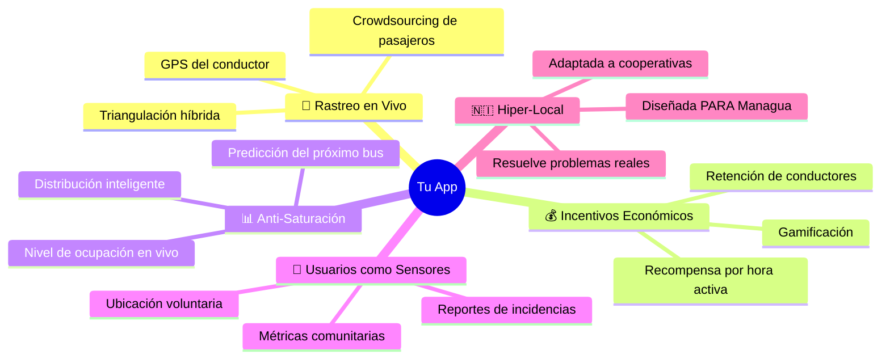
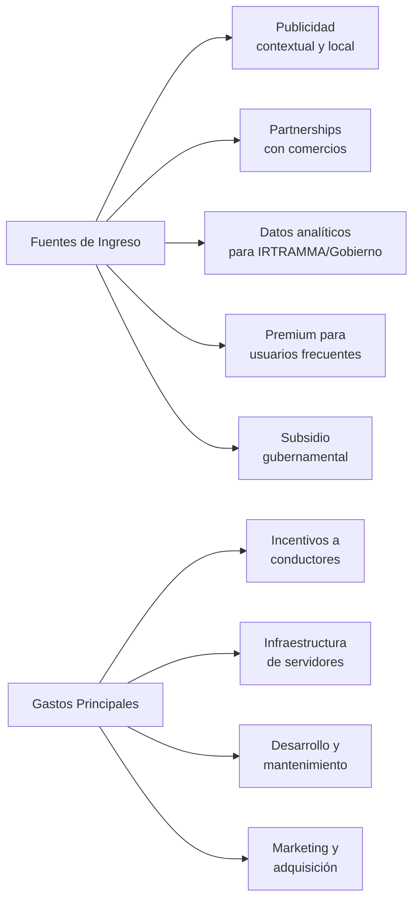

# 🚌 Análisis de Mercado: App de Rastreo de Buses en Tiempo Real para Managua

## Veredicto Rápido

> [!TIP]
> **Tu idea tiene un potencial enorme.** Estás atacando un vacío real del mercado: **no existe ninguna app que ofrezca rastreo GPS en tiempo real de los buses urbanos de Managua**. Las apps existentes solo ofrecen datos estáticos (rutas y horarios aproximados). Tu propuesta de combinar rastreo en vivo + crowdsourcing + incentivos económicos para conductores es **única en Centroamérica**.

---

## 1. Contexto del Problema en Managua

El transporte urbano colectivo (TUC) de Managua enfrenta problemas estructurales severos que validan tu idea:

| Problema | Impacto en el Usuario |
|:---|:---|
| **Sin GPS en las unidades** | Los usuarios no tienen forma de saber dónde está su bus |
| **Frecuencias inestables** | Tiempos de espera impredecibles, especialmente en horas pico |
| **Sobrecarga de pasajeros** | Buses abarrotados, viajes inseguros e incómodos |
| **Conducción temeraria** | Riesgo para pasajeros; ya se han implementado líneas de denuncia |
| **Operación por cooperativas** | No hay sistema centralizado de datos ni plataforma pública de rastreo |
| **Cambios de ruta sin aviso** | Obras de infraestructura causan desvíos que confunden a los usuarios |

> [!IMPORTANT]
> **Oportunidad clave:** El gobierno ha invertido en buses nuevos (marca Yutong, fabricación china), pero **no ha invertido en tecnología de rastreo o información al usuario**. Tu app llenaría ese vacío tecnológico.

---

## 2. Competidores en el Mercado — ¿Qué Existe Hoy?

### 2.1 Apps Locales (Nicaragua)

| App | Qué Ofrece | Qué NO Ofrece | Estado |
|:---|:---|:---|:---|
| **Mi Bus – Managua** | Consulta de líneas y horarios (datos de OpenStreetMap/MapNica) | ❌ No tiene GPS en tiempo real. El mismo desarrollador advierte que los datos pueden no ser exactos | Básica, mantenimiento limitado |
| **Rutas Nicaragua** | Calculadora de rutas, transbordos, modo offline, ahorro de datos | ❌ No tiene rastreo en vivo, no muestra ubicación de buses, no reporta saturación | Más pulida, pero solo datos estáticos |
| **Nica Autobús** | Info de buses interurbanos (terminales, horarios) | ❌ Solo para viajes entre ciudades, sin tracking urbano | Nicho interurbano |

### 2.2 Apps Globales con Presencia en Managua

| App | Qué Ofrece en Managua | Limitación en Managua |
|:---|:---|:---|
| **Moovit** | Planificación de rutas, mapas de líneas, indicaciones paso a paso | ❌ **No tiene rastreo GPS en tiempo real** para buses de Managua. Solo datos estáticos/comunitarios |
| **Google Maps** | Navegación general, ubicación de paradas | ❌ Datos de transporte público limitados y sin tracking en vivo |
| **Waze** | Navegación vehicular, alertas de tráfico | ❌ No está diseñado para transporte público |

### 2.3 Apps Referentes en LATAM (sin presencia en Nicaragua)

| App | País | Fortaleza Principal | Modelo |
|:---|:---|:---|:---|
| **TranSapp** | 🇨🇱 Chile | Red colaborativa: usuarios reportan saturación, conductores, seguridad. Usa GPS oficial + ubicación de usuarios | Crowdsourcing + GPS oficial |
| **Cittamobi** | 🇧🇷 Brasil | Tracking en tiempo real muy preciso, wallet digital, recarga de tarjetas | GPS de agencias oficiales |
| **Transit** | 🇺🇸🇨🇦 Norteamérica | Motor de predicción propio, modo "GO" para navegación paso a paso | Datos de agencias + IA predictiva |
| **Citymapper** | 🌍 Ciudades grandes | Rutas ultra-detalladas, costo del viaje, multi-modal | Datos oficiales de ciudades grandes |

---

## 3. Análisis Comparativo: Tu Idea vs. Competidores

### ¿Qué tienen ellos que tu idea también necesita?

| Feature | Moovit | TranSapp | Cittamobi | Transit | **Tu App** |
|:---|:---:|:---:|:---:|:---:|:---:|
| Mapa de rutas estáticas | ✅ | ✅ | ✅ | ✅ | ✅ Necesario |
| Planificación de viaje | ✅ | ✅ | ✅ | ✅ | ✅ Necesario |
| Rastreo GPS en tiempo real | ⚠️ Solo en ciudades con datos | ✅ | ✅ | ✅ | ✅ **Core** |
| Reportes de saturación | ❌ | ✅ | ❌ | ⚠️ Limitado | ✅ **Core** |
| Crowdsourcing de ubicación | ⚠️ Datos estáticos | ✅ | ❌ | ✅ | ✅ **Core** |
| Incentivos monetarios a conductores | ❌ | ❌ | ❌ | ❌ | ✅ **Único** |
| Usuarios como sensores activos | ❌ | ⚠️ Parcial | ❌ | ⚠️ Parcial | ✅ **Core** |
| Wallet/pagos digitales | ❌ | ❌ | ✅ | ❌ | 🔮 Fase futura |

---

## 4. Propuesta de Valor Única (Lo que TÚ tienes y NADIE más)

### 4.1 🏆 Diferenciadores Clave

#### 1. **Incentivo monetario directo a conductores** — NADIE lo hace
> Ninguna app de transporte público en LATAM ofrece recompensas monetarias por hora de uso activo a los conductores. Este es tu diferenciador más fuerte. Resuelve el mayor problema del crowdsourcing: **¿por qué participaría el conductor?**

#### 2. **Modelo híbrido de rastreo (Conductor + Pasajeros)**
> En lugar de depender solo del GPS del conductor (como Cittamobi) o solo de los usuarios (como partes de TranSapp), tu modelo combina ambas fuentes. Esto es crucial en un mercado donde no hay infraestructura oficial de GPS.

#### 3. **Anti-saturación activa con datos en tiempo real**
> TranSapp permite reportar saturación, pero tu idea va más allá: si un usuario ve que el bus viene lleno, puede ver si el siguiente ya viene cerca y tomar una decisión informada. Esto **redistribuye la demanda orgánicamente**.

#### 4. **Diseñada desde cero para el contexto de Managua**
> No es una app global adaptada. Entiende que el sistema funciona con cooperativas, que no hay datos oficiales de GPS, y que los usuarios necesitan información práctica inmediata.

---

## 5. Riesgos y Desafíos a Considerar

> [!WARNING]
> Estos no son razones para no hacerlo, sino aspectos que debes planificar:

| Riesgo | Descripción | Mitigación Sugerida |
|:---|:---|:---|
| **Adopción de conductores** | Los conductores podrían resistirse al rastreo (privacidad, control) | El incentivo monetario es clave. Empezar con cooperativas aliadas |
| **Financiamiento de incentivos** | ¿Quién paga la recompensa por hora a los conductores? | Modelo de ads, partnerships con empresas locales, subsidio gubernamental, o comisiones |
| **Problema del huevo y la gallina** | Necesitas conductores para atraer usuarios y usuarios para atraer conductores | Lanzar con 3-5 rutas piloto de alta demanda. Concentrar esfuerzos |
| **Consumo de datos/batería** | Muchos usuarios en Managua tienen planes de datos limitados | Modo de bajo consumo, compresión de datos, funcionalidad offline |
| **Precisión sin GPS oficial** | El crowdsourcing puede ser impreciso al inicio | Algoritmos de triangulación + validación cruzada conductor-pasajero |
| **Regulación** | IRTRAMMA y cooperativas podrían ver la app como amenaza | Posicionar como herramienta que COMPLEMENTA al sistema, no lo reemplaza |

---

## 6. Modelo de Negocio Potencial

---

## 7. Roadmap Sugerido por Fases

### Fase 1 — MVP (3-4 meses)
- [ ] App para conductores con GPS tracking + incentivo por hora
- [ ] App para usuarios: mapa con ubicación de buses en 3-5 rutas piloto
- [ ] Indicador básico de saturación (reportado por conductor o usuarios)
- [ ] Rutas más transitadas de Managua como piloto

### Fase 2 — Crecimiento (4-6 meses)
- [ ] Expansión a más rutas
- [ ] Usuarios como sensores activos (opt-in de ubicación)
- [ ] Predicción de tiempos de llegada basada en datos históricos
- [ ] Sistema de gamificación (badges, leaderboards)
- [ ] Notificaciones push ("Tu bus está a 5 minutos")

### Fase 3 — Madurez (6-12 meses)
- [ ] IA para predicción de saturación y optimización
- [ ] Panel analítico para cooperativas y gobierno
- [ ] Integración con otras ciudades de Nicaragua
- [ ] Wallet digital para pago de pasaje
- [ ] Reportes de conducción temeraria integrados

---

## 8. Conclusión

| Aspecto | Evaluación |
|:---|:---|
| **¿Existe mercado?** | ✅ Sí. 1.5M+ habitantes en Managua que dependen del TUC |
| **¿Hay competencia directa?** | ❌ No. Nadie ofrece rastreo GPS en vivo en Managua |
| **¿El problema es real?** | ✅ Absolutamente. Frecuencias impredecibles y sobrecarga son quejas constantes |
| **¿La propuesta de valor es diferenciada?** | ✅ Sí. El modelo de incentivos + crowdsourcing híbrido es único |
| **¿Es técnicamente viable?** | ✅ Sí. Solo requiere smartphones con GPS (que ya tienen los conductores) |
| **¿Es sostenible económicamente?** | ⚠️ Requiere un modelo de monetización claro para financiar incentivos |

> [!TIP]
> **Recomendación final:** Tu idea no solo es buena, **es necesaria**. El timing es ideal porque el gobierno está invirtiendo en buses nuevos pero no en tecnología de información al usuario. Sugiero arrancar con un MVP enfocado en 3-5 rutas de alta demanda, con un grupo piloto de conductores incentivados, y medir tracción antes de escalar.
