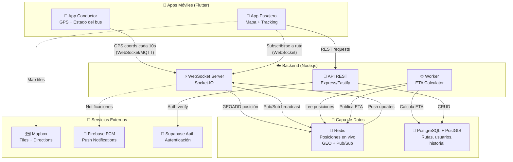
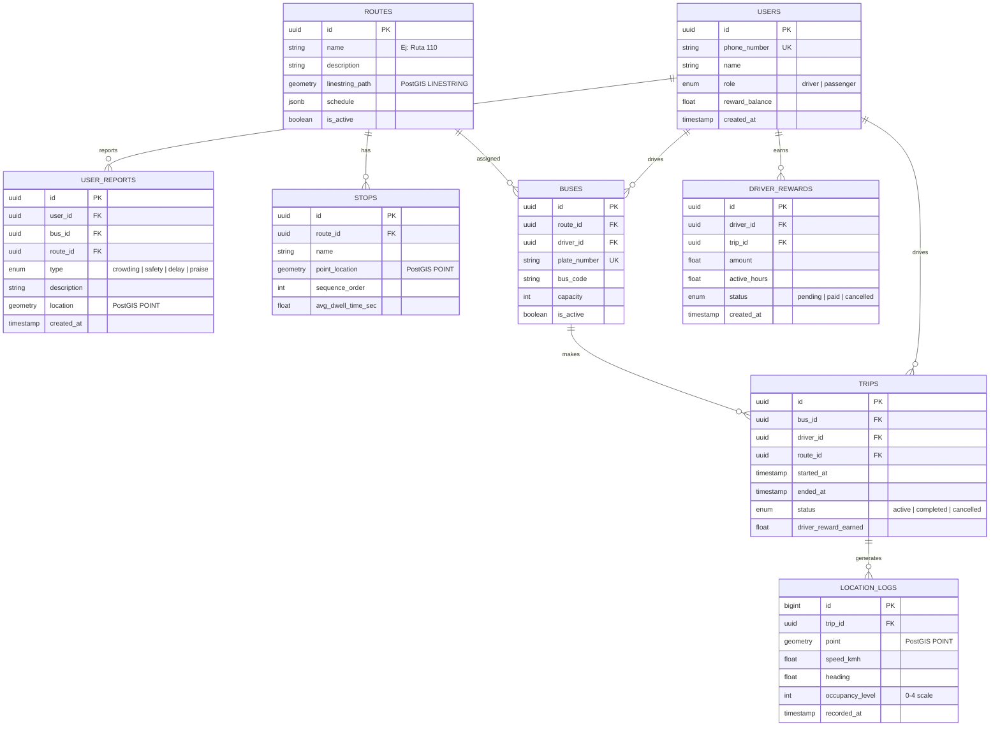
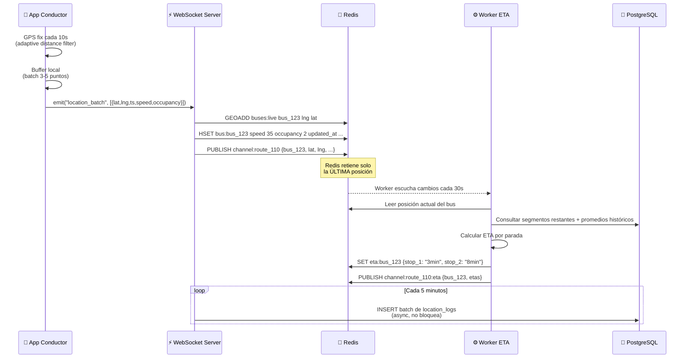
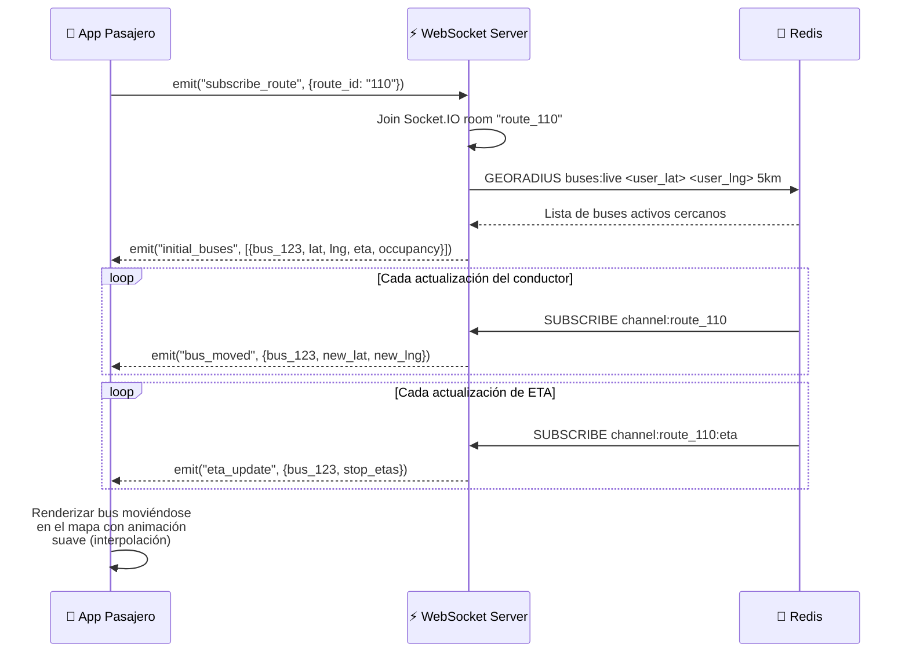
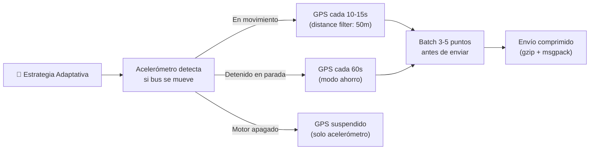
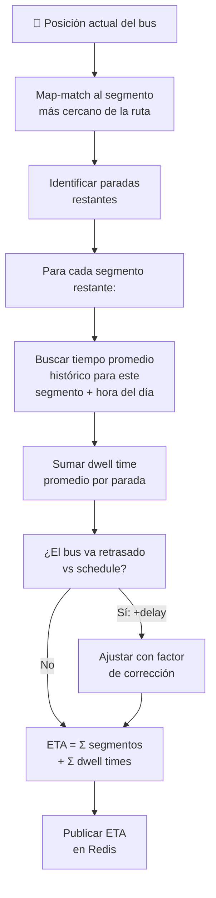
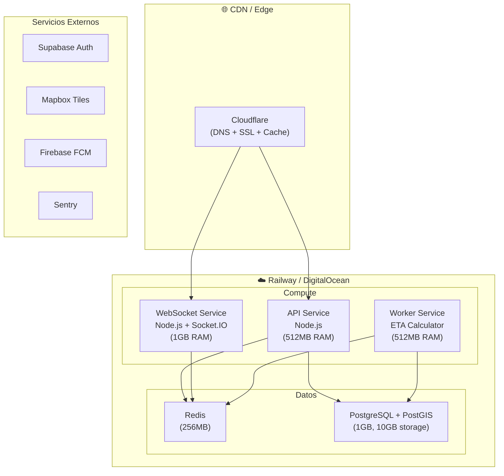

# 🏗️ Arquitectura Técnica — MVP App de Buses Managua

## Resumen Ejecutivo

Este documento detalla **todo lo necesario a nivel técnico** para construir un MVP funcional: dos apps móviles (conductor y pasajero), un backend en tiempo real, base de datos geoespacial, y despliegue en la nube. Está diseñado para ser **económico, escalable, y optimizado para las condiciones de Managua** (datos móviles limitados, conectividad intermitente).

---

## 1. Arquitectura de Alto Nivel



---

## 2. Stack Tecnológico Completo

### ¿Por qué cada tecnología?

| Capa | Tecnología | Justificación |
|:---|:---|:---|
| **Mobile** | **Flutter (Dart)** | Una sola codebase para Android e iOS. Rendimiento nativo. Excelente soporte para mapas y GPS en background. La mayoría de usuarios en Managua usan Android, pero Flutter te prepara para iOS también |
| **Backend API** | **Node.js + Fastify** | Alta concurrencia, manejo eficiente de WebSockets, ecosistema enorme, fácil de contratar desarrolladores |
| **Real-time** | **Socket.IO** | WebSocket con fallback automático a polling. Maneja reconexiones (crucial con conectividad intermitente en Managua). Rooms para agrupar por ruta |
| **Cache/Real-time DB** | **Redis 7+** | Comandos GEO nativos (`GEOADD`, `GEORADIUS`). Pub/Sub para broadcast. Sub-milisegundo de latencia. Perfecto para "¿dónde está el bus AHORA?" |
| **Base de Datos** | **PostgreSQL 16 + PostGIS** | Estándar de la industria para datos geoespaciales. Consultas espaciales complejas. Open source, sin vendor lock-in |
| **Autenticación** | **Supabase Auth** | Gratis hasta 50K MAU. Basado en PostgreSQL (consistente con tu stack). Social login, magic links, JWT |
| **Mapas** | **Mapbox GL** | 50K cargas/mes gratis. Tiles vectoriales (menos datos). Personalización visual total. Más barato que Google Maps a escala |
| **Push Notifs** | **Firebase Cloud Messaging** | Gratis, confiable, estándar de la industria para push en Android/iOS |
| **Monitoreo** | **Sentry (errores) + Uptime Robot** | Sentry tiene tier gratis para errores. Uptime Robot gratis para health checks |

### Librerías Flutter Clave

```yaml
# pubspec.yaml — dependencias principales
dependencies:
  flutter_map: ^7.0.0          # Mapa con Mapbox tiles (open source)
  geolocator: ^13.0.0          # GPS con battery-efficient modes
  socket_io_client: ^3.0.0     # WebSocket client
  riverpod: ^2.6.0             # State management
  dio: ^5.7.0                  # HTTP client con retry/interceptors
  hive: ^4.0.0                 # Cache local offline (ligero)
  supabase_flutter: ^2.8.0     # Auth + optional DB
  firebase_messaging: ^15.0.0  # Push notifications
  flutter_local_notifications: # Notificaciones locales
  connectivity_plus: ^6.1.0    # Detectar estado de red
  battery_plus: ^6.0.0         # Monitorear batería
```

---

## 3. Diseño de Base de Datos



### SQL de Inicialización (PostGIS)

```sql
-- Habilitar extensiones
CREATE EXTENSION IF NOT EXISTS "uuid-ossp";
CREATE EXTENSION IF NOT EXISTS "postgis";

-- Tabla de rutas con geometría
CREATE TABLE routes (
    id UUID PRIMARY KEY DEFAULT uuid_generate_v4(),
    name VARCHAR(100) NOT NULL,
    description TEXT,
    path GEOGRAPHY(LINESTRING, 4326), -- Ruta completa como línea
    schedule JSONB DEFAULT '{}',
    is_active BOOLEAN DEFAULT true,
    created_at TIMESTAMPTZ DEFAULT NOW()
);

-- Tabla de paradas con punto geográfico
CREATE TABLE stops (
    id UUID PRIMARY KEY DEFAULT uuid_generate_v4(),
    route_id UUID REFERENCES routes(id),
    name VARCHAR(200) NOT NULL,
    location GEOGRAPHY(POINT, 4326) NOT NULL,
    sequence_order INTEGER NOT NULL,
    avg_dwell_time_sec FLOAT DEFAULT 30,
    UNIQUE(route_id, sequence_order)
);

-- Índice espacial para búsquedas rápidas
CREATE INDEX idx_stops_location ON stops USING GIST(location);

-- Location logs con particionamiento por fecha (para escala)
CREATE TABLE location_logs (
    id BIGSERIAL,
    trip_id UUID NOT NULL,
    point GEOGRAPHY(POINT, 4326) NOT NULL,
    speed_kmh FLOAT,
    heading FLOAT,
    occupancy_level SMALLINT DEFAULT 0 CHECK (occupancy_level BETWEEN 0 AND 4),
    recorded_at TIMESTAMPTZ NOT NULL DEFAULT NOW()
) PARTITION BY RANGE (recorded_at);

-- Crear partición del mes actual
CREATE TABLE location_logs_2026_08 PARTITION OF location_logs
    FOR VALUES FROM ('2026-08-01') TO ('2026-09-01');

CREATE INDEX idx_location_logs_trip ON location_logs(trip_id, recorded_at);
```

---

## 4. Flujos de Datos en Tiempo Real

### 4.1 Flujo del Conductor (Envío de GPS)



### 4.2 Flujo del Pasajero (Recepción de Tracking)



---

## 5. API REST — Endpoints del MVP

### Autenticación
| Método | Endpoint | Descripción |
|:---|:---|:---|
| `POST` | `/auth/register` | Registro con teléfono (OTP via SMS) |
| `POST` | `/auth/login` | Login con OTP |
| `POST` | `/auth/refresh` | Refresh token JWT |

### Rutas y Paradas
| Método | Endpoint | Descripción |
|:---|:---|:---|
| `GET` | `/routes` | Listar todas las rutas activas |
| `GET` | `/routes/:id` | Detalle de ruta + geometría + paradas |
| `GET` | `/routes/:id/stops` | Paradas ordenadas de una ruta |
| `GET` | `/routes/nearby?lat=&lng=&radius=` | Rutas cercanas al usuario |

### Buses en Vivo
| Método | Endpoint | Descripción |
|:---|:---|:---|
| `GET` | `/buses/live?route_id=` | Buses activos en una ruta (snapshot) |
| `GET` | `/buses/:id/eta` | ETAs del bus a cada parada |
| `GET` | `/buses/:id/occupancy` | Nivel de ocupación actual |

### Conductor
| Método | Endpoint | Descripción |
|:---|:---|:---|
| `POST` | `/trips/start` | Iniciar un viaje (activa tracking) |
| `POST` | `/trips/:id/end` | Finalizar viaje |
| `PUT` | `/trips/:id/occupancy` | Actualizar nivel de ocupación |
| `GET` | `/driver/rewards` | Ver recompensas acumuladas |
| `GET` | `/driver/stats` | Estadísticas del conductor |

### Reportes de Usuarios
| Método | Endpoint | Descripción |
|:---|:---|:---|
| `POST` | `/reports` | Crear reporte (saturación, seguridad, etc.) |
| `GET` | `/reports?route_id=&type=` | Ver reportes recientes de una ruta |

### WebSocket Events

```
// Cliente → Servidor
subscribe_route      { route_id }           // Pasajero se suscribe a una ruta
unsubscribe_route    { route_id }           // Pasajero deja de escuchar
location_batch       [{ lat, lng, ts, ... }] // Conductor envía batch de GPS
update_occupancy     { level: 0-4 }         // Conductor reporta ocupación

// Servidor → Cliente
initial_buses        [{ bus_id, lat, lng, eta, occupancy }]
bus_moved            { bus_id, lat, lng, speed, heading }
bus_entered_route    { bus_id, ... }         // Nuevo bus activo en ruta
bus_left_route       { bus_id }             // Bus terminó su recorrido
eta_update           { bus_id, stop_etas: {} }
occupancy_changed    { bus_id, level }
```

---

## 6. Optimizaciones Críticas para Managua

> [!IMPORTANT]
> Estas optimizaciones no son opcionales — son **necesarias** para que la app funcione bien en el contexto de Managua, donde los planes de datos son limitados y la conectividad es intermitente.

### 6.1 Ahorro de Batería (App Conductor)



| Técnica | Descripción | Impacto |
|:---|:---|:---|
| **Distance Filter** | Solo registrar nuevo punto si el bus se movió >50m | Reduce puntos ~60% |
| **Sensor Fusion** | Usar acelerómetro para detectar movimiento antes de activar GPS | Ahorra batería cuando el bus está detenido |
| **Batching** | Agrupar 3-5 puntos GPS antes de transmitir | Menos wakeups de radio celular |
| **Compresión** | MessagePack en vez de JSON + gzip | ~70% menos datos |
| **Hibernate** | Detectar motor apagado → suspender GPS | Cero consumo en inactividad |

### 6.2 Ahorro de Datos (App Pasajero)

| Técnica | Descripción | Ahorro estimado |
|:---|:---|:---|
| **Tiles vectoriales** (Mapbox) | Mapas 10x más livianos que raster | ~80% vs Google Maps raster |
| **Cache de tiles** | Almacenar tiles del área de Managua localmente | Elimina re-descargas |
| **Delta updates** | Solo enviar cambios de posición, no posición completa | ~50% menos payload |
| **Cache de rutas** | Guardar geometría de rutas en SQLite/Hive local | Solo descarga 1 vez |
| **Lazy loading** | Solo cargar buses de la ruta seleccionada | Reduce tráfico WebSocket |
| **Reconexión inteligente** | Backoff exponencial + última posición conocida | UX fluida sin conexión |

### 6.3 Modo Offline

```
📱 Sin conexión → Mostrar:
├── 🗺️ Mapa cacheado de Managua (tiles offline)
├── 🛣️ Rutas guardadas localmente
├── 🕐 Última posición conocida de buses (con timestamp)
├── 📊 Horarios estimados basados en historial
└── ⚠️ Banner: "Sin conexión - datos de hace X minutos"

📱 Al reconectar →
├── Sync posiciones actualizadas
├── Enviar GPS buffer acumulado (conductor)
└── Reconciliar reportes pendientes
```

---

## 7. Algoritmo de ETA (Simple pero Efectivo)

Para el MVP, usamos un enfoque de **promedio histórico por segmento + corrección en tiempo real**:

```
ETA_parada_N = Tiempo_actual 
             + Σ(Tiempo_promedio_segmento[i → i+1])  // por franja horaria
             + Σ(Dwell_time_parada[i])                // tiempo en cada parada
             + Factor_retraso_actual                   // si el bus va atrasado
```



> [!NOTE]
> Con 2-4 semanas de datos históricos acumulados, este algoritmo simple alcanza ~80% de precisión. Después se puede mejorar con ML (Fase 2).

---

## 8. Infraestructura y Despliegue

### 8.1 Arquitectura de Despliegue



### 8.2 Opción A: Railway (Recomendado para MVP)

> [!TIP]
> **Railway** es la opción más rápida para lanzar. Un solo dashboard para servicios, base de datos, y Redis. Deploy con `git push`.

| Servicio | Specs | Costo estimado/mes |
|:---|:---|:---|
| API Service | 0.5 vCPU, 512MB | ~$5 |
| WebSocket Service | 1 vCPU, 1GB | ~$10 |
| Worker Service | 0.5 vCPU, 512MB | ~$5 |
| PostgreSQL + PostGIS | 1GB RAM, 10GB disk | ~$10 |
| Redis | 256MB | ~$5 |
| **Total Railway** | | **~$35/mes** |

### 8.3 Opción B: DigitalOcean (Más control, más barato)

| Servicio | Specs | Costo/mes |
|:---|:---|:---|
| Droplet (todo-en-uno) | 2 vCPU, 4GB RAM, 80GB SSD | $24 |
| Managed PostgreSQL | Basic, 1GB RAM, 10GB | $15 |
| Redis (en el mismo Droplet) | Incluido | $0 |
| **Total DigitalOcean** | | **~$39/mes** |

### 8.4 Servicios Externos (Free Tiers)

| Servicio | Free Tier | Suficiente para MVP? |
|:---|:---|:---|
| **Mapbox** | 50K map loads/mes | ✅ Sí |
| **Supabase Auth** | 50K MAU | ✅ Sí |
| **Firebase FCM** | Ilimitado | ✅ Sí |
| **Sentry** | 5K errores/mes | ✅ Sí |
| **Cloudflare** | DNS + SSL gratis | ✅ Sí |
| **GitHub Actions** | 2K min CI/CD/mes | ✅ Sí |

### 💰 Costo Total Estimado del MVP

| Concepto | Mensual |
|:---|:---|
| Hosting (Railway) | ~$35 |
| Dominio (.com) | ~$1 |
| SMS OTP (Twilio — 100 users) | ~$5-10 |
| Servicios externos (free tiers) | $0 |
| **TOTAL** | **~$45-50 USD/mes** |

---

## 9. Estructura del Proyecto (Monorepo)

```
managua-buses/
├── apps/
│   ├── mobile/                    # Flutter app (conductor + pasajero)
│   │   ├── lib/
│   │   │   ├── core/              # Config, theme, constants, DI
│   │   │   ├── features/
│   │   │   │   ├── auth/          # Login, registro, OTP
│   │   │   │   ├── map/           # Mapa principal, tracking en vivo
│   │   │   │   ├── routes/        # Lista y detalle de rutas
│   │   │   │   ├── driver/        # Panel del conductor, rewards
│   │   │   │   └── reports/       # Reportes de usuarios
│   │   │   ├── models/            # Data classes / entities
│   │   │   ├── services/          # API client, WebSocket, GPS
│   │   │   └── shared/            # Widgets reutilizables
│   │   ├── android/
│   │   ├── ios/
│   │   └── pubspec.yaml
│   │
│   └── backend/                   # Node.js backend
│       ├── src/
│       │   ├── config/            # Env vars, DB config
│       │   ├── modules/
│       │   │   ├── auth/          # Controladores + middleware JWT
│       │   │   ├── routes/        # CRUD de rutas y paradas
│       │   │   ├── buses/         # Estado de buses, live tracking
│       │   │   ├── trips/         # Gestión de viajes
│       │   │   ├── tracking/      # WebSocket handlers + Redis
│       │   │   ├── eta/           # Worker de cálculo de ETA
│       │   │   ├── rewards/       # Sistema de recompensas
│       │   │   └── reports/       # Reportes de usuarios
│       │   ├── middleware/        # Auth, rate limit, error handler
│       │   ├── utils/             # Helpers geoespaciales
│       │   └── app.ts             # Entry point
│       ├── prisma/                # Schema + migrations
│       ├── Dockerfile
│       └── package.json
│
├── packages/
│   └── shared/                    # Tipos compartidos, validaciones
│
├── infra/
│   ├── docker-compose.yml         # Dev environment local
│   ├── railway.toml               # Config de Railway
│   └── seed/                      # Datos de rutas de Managua
│
├── docs/                          # Documentación del proyecto
└── README.md
```

---

## 10. DevOps y CI/CD

### Docker Compose (Desarrollo Local)

```yaml
# docker-compose.yml
version: '3.8'
services:
  api:
    build: ./apps/backend
    ports: ["3000:3000", "3001:3001"]  # REST + WebSocket
    environment:
      DATABASE_URL: postgresql://postgres:postgres@db:5432/buses
      REDIS_URL: redis://redis:6379
    depends_on: [db, redis]
    volumes:
      - ./apps/backend/src:/app/src  # Hot reload

  db:
    image: postgis/postgis:16-3.4
    ports: ["5432:5432"]
    environment:
      POSTGRES_DB: buses
      POSTGRES_PASSWORD: postgres
    volumes:
      - pgdata:/var/lib/postgresql/data

  redis:
    image: redis:7-alpine
    ports: ["6379:6379"]

volumes:
  pgdata:
```

### CI/CD Pipeline (GitHub Actions)

```yaml
# .github/workflows/deploy.yml
name: Deploy
on:
  push:
    branches: [main]

jobs:
  test:
    runs-on: ubuntu-latest
    steps:
      - uses: actions/checkout@v4
      - run: npm ci && npm test
        working-directory: apps/backend

  deploy-backend:
    needs: test
    runs-on: ubuntu-latest
    steps:
      - uses: actions/checkout@v4
      - uses: railwayapp/deploy@v1  # Deploy automático a Railway
        with:
          service: backend
```

---

## 11. Seguridad

| Aspecto | Implementación |
|:---|:---|
| **Autenticación** | JWT con Supabase Auth. Tokens con expiración corta (15min) + refresh tokens |
| **Autorización** | Middleware que verifica rol (driver vs passenger) por endpoint |
| **API Rate Limiting** | 100 req/min por usuario. Protección DDoS con Cloudflare |
| **Datos en tránsito** | TLS/SSL obligatorio (Cloudflare + Let's Encrypt) |
| **GPS del conductor** | Solo visible como punto en el mapa, nunca se expone identidad del conductor a pasajeros |
| **Datos del pasajero** | Ubicación procesada anónimamente, nunca persistida con identidad |
| **Validación** | Zod en backend para validar todos los inputs. Sanitización contra injection |
| **Secrets** | Variables de entorno en Railway, nunca en código |

---

## 12. Cronograma del MVP (14 semanas)

```mermaid
gantt
    title Cronograma MVP — App Buses Managua
    dateFormat  YYYY-MM-DD
    axisFormat  %b %d
    
    section Fundación
    Setup monorepo + Docker + CI/CD          :f1, 2026-09-01, 5d
    Diseño de BD + migrations PostGIS        :f2, after f1, 4d
    Auth (Supabase) + middleware JWT          :f3, after f1, 5d
    Seed data: 3-5 rutas piloto de Managua   :f4, after f2, 3d

    section Backend Core
    API REST: rutas, paradas, buses          :b1, after f3, 7d
    WebSocket server + Redis Pub/Sub         :b2, after b1, 7d
    Ingesta de GPS + batching a PostgreSQL   :b3, after b2, 5d
    Worker ETA (promedio histórico)           :b4, after b3, 5d
    Sistema de recompensas (conductor)        :b5, after b4, 4d

    section Mobile — Conductor
    UI login + selección de ruta             :d1, after f3, 5d
    GPS tracking en background               :d2, after d1, 7d
    Panel: ocupación + estado del viaje      :d3, after d2, 5d
    Dashboard de recompensas                 :d4, after d3, 3d

    section Mobile — Pasajero
    Mapa con Mapbox + tiles offline          :p1, after f3, 7d
    Lista de rutas + búsqueda               :p2, after p1, 4d
    Tracking en vivo (WebSocket)             :p3, after b2, 7d
    ETAs + nivel de ocupación                :p4, after p3, 5d
    Reportes de usuario                      :p5, after p4, 3d

    section Testing + Deploy
    Testing E2E + optimización               :t1, after d4, 7d
    Deploy a producción (Railway)            :t2, after t1, 3d
    Beta con conductores piloto              :t3, after t2, 5d
```

> [!NOTE]
> Este cronograma asume **2-3 desarrolladores full-time**. Con 1 desarrollador, multiplica por ~2x. Las secciones Backend y Mobile pueden trabajarse **en paralelo** por diferentes devs.

---

## 13. Verificación y Métricas del MVP

### Checklist de "Listo para Beta"

- [ ] Conductor puede iniciar viaje y su GPS se rastrea en tiempo real
- [ ] Pasajero ve el bus moviéndose en el mapa en ≤3 segundos de delay
- [ ] ETA se muestra para cada parada con ≤30% de error
- [ ] Nivel de ocupación visible para el pasajero
- [ ] App del conductor consume ≤5% batería/hora en background
- [ ] App del pasajero consume ≤2MB de datos en 30 min de uso
- [ ] Funciona con conectividad intermitente (modo offline graceful)
- [ ] 3-5 rutas piloto cargadas con geometría real de Managua
- [ ] Sistema de recompensas registra horas activas del conductor

### KPIs para el Piloto

| Métrica | Objetivo MVP |
|:---|:---|
| Latencia GPS → Mapa | < 3 segundos |
| Precisión ETA | ≤ 5 min de error |
| Uptime del backend | > 99% |
| Conductores activos/día | ≥ 10 en rutas piloto |
| Usuarios activos/día | ≥ 100 |
| Crash rate | < 1% de sesiones |
| Datos consumidos (pasajero) | < 2MB / 30 min |
| Batería consumida (conductor) | < 5% / hora |

---

## Decisiones Confirmadas ✅

| Pregunta | Decisión | Implicación |
|:---|:---|:---|
| **¿Una o dos apps?** | ✅ **Una sola app** con dos modos (conductor/pasajero) | Routing condicional por rol. APK único |
| **¿Cómo se cargan rutas?** | ✅ **Trazar manualmente** (las rutas cambian por obras del gobierno) | Herramienta de trazado de rutas. Flexibilidad para editar |
| **¿Modelo de incentivo?** | ✅ **Mixto** — no solo dinero (gamificación, status, reconocimiento) | Sistema de badges + leaderboard + métricas |
| **¿Autenticación?** | ✅ **SMS OTP** | Supabase Auth + Twilio (~$0.05/SMS) |
| **¿Equipo?** | ✅ **2 desarrolladores + Claude Code Pro + Codex Plus** | Timeline ~12-14 semanas |
