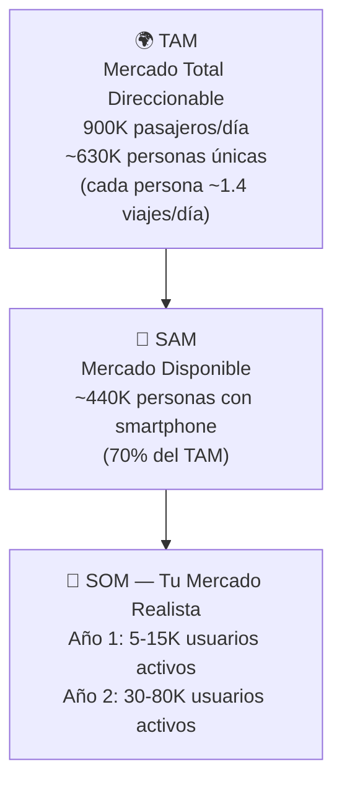
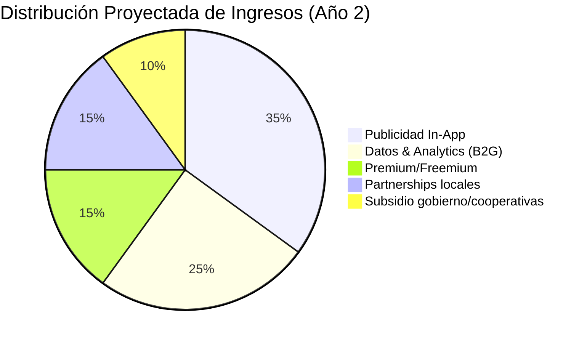
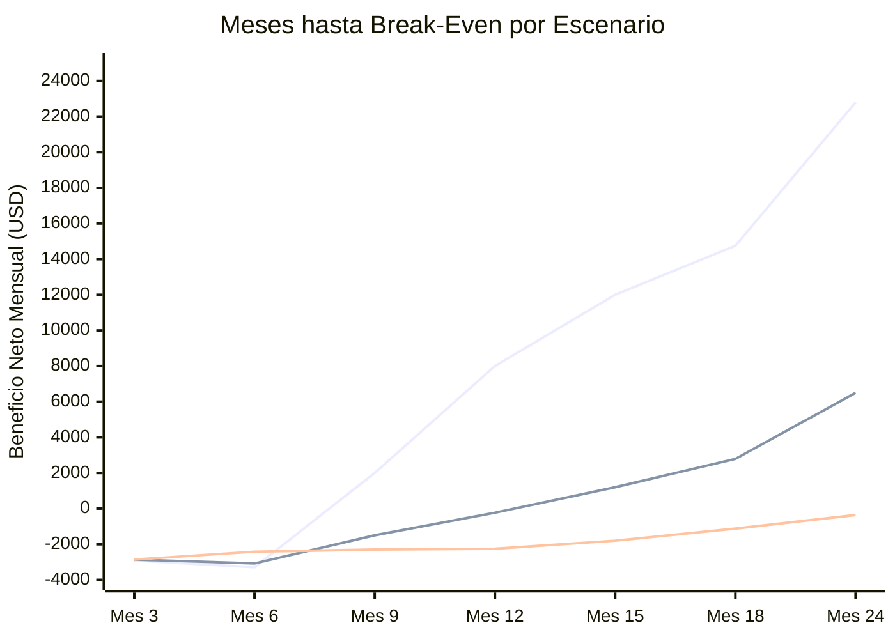

# 💰 Modelo Financiero — App Buses Managua

## Datos Clave del Mercado

| Métrica | Valor | Fuente |
|:---|:---|:---|
| Población Managua | ~1.3 millones | Estimación 2025 |
| Pasajeros diarios TUC | **~900,000** | Datos oficiales IRTRAMMA |
| Buses activos | ~1,100 unidades | Flota modernizada 2025-2026 |
| Rutas activas | ~35-45 rutas | Sistema urbano |
| Penetración internet Nicaragua | ~70% de la población | DataReportal 2025 |
| Conexiones móviles | 8.9M (126% de la población) | DataReportal 2025 |
| Salario mínimo (transporte) | ~$298 USD/mes | Sector transporte 2025 |
| Salario promedio formal | ~$490-540 USD/mes | Estimación sector formal |
| Pasaje de bus | C$2.50 (~$0.07 USD) | Tarifa subsidiada |

> [!NOTE]
> **900,000 pasajeros diarios** es un mercado enorme para una ciudad de 1.3M de habitantes. Significa que la mayoría de la población usa el bus al menos una vez al día. Tu mercado potencial es casi toda la ciudad.

---

## 1. Tamaño del Mercado (TAM → SAM → SOM)



| Nivel | Usuarios | Justificación |
|:---|:---|:---|
| **TAM** | ~630K personas únicas/día | 900K viajes ÷ 1.4 viajes/persona promedio |
| **SAM** | ~440K personas | 70% con smartphone + internet |
| **SOM Año 1** | 5K - 15K MAU | Adopción realista con 5-10 rutas, boca a boca |
| **SOM Año 2** | 30K - 80K MAU | Si hay tracción, expansión a todas las rutas |

---

## 2. Fuentes de Ingreso

### Modelo de monetización mixto (5 fuentes)



### Detalle por Fuente

#### 💡 Fuente 1: Publicidad In-App (35% de ingresos)

| Métrica | Valor conservador | Valor optimista |
|:---|:---|:---|
| CPM banners (Nicaragua/LATAM) | $0.50 | $1.50 |
| CPM interstitial/video | $2.00 | $5.00 |
| Impresiones/usuario/día | 3-5 (banners) + 1 (video) | 5-8 (banners) + 2 (video) |
| eCPM promedio ponderado | **$1.00** | **$2.50** |

> **Cálculo:** Con 10K DAU × 5 impresiones/día × $1.00 eCPM ÷ 1000 = **$50/día = $1,500/mes**

**Tipos de anuncios recomendados:**
- 🏪 **Negocios locales** cerca de paradas de bus (restaurantes, farmacias, pulperías)
- 📱 **Recargas de saldo** (Claro, Tigo) — altamente relevante
- 🏦 **Fintech/bancos** (BAC, Banpro) — apps de pago móvil
- 🎓 **Universidades/institutos** — rutas pasan por campus

> [!TIP]
> La publicidad contextual por ubicación (mostrar anuncios de negocios cerca de la parada del usuario) tiene CPMs 2-3x más altos que banners genéricos. Es tu ventaja competitiva en ads.

---

#### 💡 Fuente 2: Datos & Analytics B2G (25% de ingresos)

Vendes datos anonimizados y dashboards a:

| Cliente | Qué compran | Precio estimado |
|:---|:---|:---|
| **IRTRAMMA / Alcaldía** | Dashboard de rutas: frecuencia real, tiempos, demanda por parada, saturación | $300-800/mes por suscripción |
| **Cooperativas** | Métricas de sus buses: cumplimiento de horario, KPIs de conductores | $100-300/mes por cooperativa |
| **Planificadores urbanos** | Datos agregados de movilidad: origen-destino, patrones de viaje | $500-2,000 por reporte |
| **ONGs / BID / Banco Mundial** | Datos para estudios de transporte en Centroamérica | $1,000-5,000 por dataset |

> **Potencial:** Si vendes a IRTRAMMA + 3 cooperativas + 1 reporte trimestral = **$800 + $600 + $500 = ~$1,900/mes**

---

#### 💡 Fuente 3: Premium / Freemium (15% de ingresos)

| Feature | Gratis | Premium ($0.99-1.99/mes) |
|:---|:---|:---|
| Tracking en vivo | ✅ 3 rutas | ✅ Todas las rutas |
| Anuncios | Con ads | Sin ads |
| Notificaciones | "Tu bus llegó" | "Tu bus sale en 5 min" + predicción |
| Historial | 7 días | 30 días + estadísticas personales |
| Rutas favoritas | 2 | Ilimitadas |
| Alertas de saturación | ❌ | ✅ "Ruta 110 va con espacio" |

> **Cálculo:** Si 3-5% de MAU pagan premium:
> - 10K MAU × 4% × $1.50/mes = **$600/mes**
> - 50K MAU × 4% × $1.50/mes = **$3,000/mes**

> [!NOTE]
> En Nicaragua, $1.50/mes es accesible (~C$55). Es menos que una recarga mínima de teléfono. Pero la conversión a premium en países de bajo ingreso tiende a ser 2-4%, no el 5-10% de mercados desarrollados.

---

#### 💡 Fuente 4: Partnerships con Negocios Locales (15% de ingresos)

| Partnership | Modelo | Ingreso estimado |
|:---|:---|:---|
| **Recargas Claro/Tigo** | Comisión por recarga desde la app (1-3%) | $200-500/mes |
| **Cupones de negocios** | Negocios pagan por aparecer como "cerca de tu parada" | $50-150/mes por negocio × 10 negocios |
| **Publicidad de eventos** | Promoción de eventos con rutas de bus que pasan cerca | $100-300/evento |

> **Potencial:** 10 partnerships × $100/mes promedio = **$1,000/mes**

---

#### 💡 Fuente 5: Subsidio Gobierno/Cooperativas (10% de ingresos)

| Concepto | Justificación | Monto potencial |
|:---|:---|:---|
| **Subsidio por mejora del servicio** | Gobierno ya subsidia el pasaje. Subsidiar tecnología de información es una extensión lógica | $500-2,000/mes |
| **Pago de cooperativas por visibilidad** | Cooperativas podrían pagar por aparecer como "servicio confiable" | $50-100/mes por cooperativa |

> Este ingreso es el más incierto pero potencialmente el más grande a largo plazo. Requiere relaciones con el gobierno.

---

## 3. Estructura de Costos

### 3.1 Costos de Desarrollo (One-time + Ongoing)

| Concepto | Costo Mes 1-3 | Costo Mensual Ongoing |
|:---|:---|:---|
| 2 Desarrolladores (salario Nicaragua) | $800-1,200/mes c/u | $800-1,200/mes c/u |
| Claude Code Pro | ~$200/mes | ~$200/mes |
| Codex Plus (OpenAI) | ~$200/mes | Se puede cancelar post-MVP |
| **Subtotal Desarrollo** | **~$2,200-2,800/mes** | **~$1,800-2,400/mes** |

> [!NOTE]
> Asumiendo salarios de mercado para desarrolladores en Nicaragua (~$800-1,200 USD/mes para dev mid-senior). Si los fundadores son los devs, este costo es "sweat equity" y no sale del bolsillo.

### 3.2 Costos de Infraestructura (por fase de escala)

| Escala | Infra | Mapbox | SMS OTP | Otros | Total/mes |
|:---|:---|:---|:---|:---|:---|
| **0-1K usuarios** | $45 | $0 (free tier) | $10 | $5 | **~$60** |
| **1K-5K usuarios** | $80 | $0 (free tier) | $30 | $10 | **~$120** |
| **5K-15K usuarios** | $150 | $50 | $50 | $20 | **~$270** |
| **15K-50K usuarios** | $400 | $150 | $100 | $50 | **~$700** |
| **50K-100K usuarios** | $1,000 | $400 | $200 | $100 | **~$1,700** |

### 3.3 Costos de Incentivos a Conductores

Esto es tu **costo más variable** y más importante de controlar:

| Modelo | Costo por conductor/mes | Con 50 conductores | Con 200 conductores |
|:---|:---|:---|:---|
| **$0.25/hora activa** (8h/día × 25 días) | $50/mes | $2,500/mes | $10,000/mes |
| **$0.15/hora activa** | $30/mes | $1,500/mes | $6,000/mes |
| **Gamificación pura** (sin dinero) | $0 | $0 | $0 |
| **Híbrido: $0.10/hora + badges** | $20/mes | $1,000/mes | $4,000/mes |

> [!WARNING]
> **El incentivo a conductores es el costo que puede comerte las ganancias.** A $0.25/hora con 200 conductores, estás pagando $10K/mes. Con $0.10/hora + gamificación, $4K/mes. 
> 
> **Recomendación:** Empezar con **gamificación pura + beneficios no monetarios** (recargas, descuentos en talleres, reconocimiento). Introducir dinero solo si la adopción lo requiere, y empezar bajo ($0.10/hora).

### 3.4 Otros Costos Operativos

| Concepto | Mensual |
|:---|:---|
| Marketing (redes sociales, volantes en paradas) | $100-300 |
| Soporte al usuario (1 persona part-time) | $200-400 |
| Legal/contabilidad | $50-100 |
| Dominio + servicios varios | $15 |
| **Subtotal Operativo** | **~$365-815** |

---

## 4. Proyecciones Financieras — 3 Escenarios a 24 Meses

### Supuestos Clave

| Variable | Pesimista | Base | Optimista |
|:---|:---|:---|:---|
| MAU al mes 6 | 2,000 | 5,000 | 10,000 |
| MAU al mes 12 | 5,000 | 15,000 | 40,000 |
| MAU al mes 24 | 10,000 | 40,000 | 80,000 |
| DAU/MAU ratio | 30% | 40% | 50% |
| eCPM promedio | $0.70 | $1.00 | $2.00 |
| Conversión premium | 2% | 3.5% | 5% |
| Partnerships activas | 3 | 8 | 15 |
| Contratos B2G | 0 | 1 | 3 |
| Conductores activos | 20 | 50 | 150 |
| Incentivo/conductor/mes | $30 | $25 | $20 |

---

### 📊 Escenario BASE — P&L Mensual Proyectado

```
                    Mes 1-3      Mes 6        Mes 12       Mes 18       Mes 24
                   (Pre-launch)  (Lanzamiento) (Crecimiento) (Tracción)   (Madurez)
─────────────────────────────────────────────────────────────────────────────────
USUARIOS
  MAU                 0          2,000         15,000       28,000       40,000
  DAU                 0            800          6,000       11,200       16,000
  Conductores         5 (beta)      20             50           80          120
  
INGRESOS
  Publicidad         $0            $120         $1,800       $3,920       $6,400
  Datos B2G          $0              $0           $800       $1,500       $2,500
  Premium            $0             $30           $788       $1,470       $2,100
  Partnerships       $0             $50           $800       $1,200       $1,500
  Subsidio/otros     $0              $0           $300         $500       $1,000
  ───────────────────────────────────────────────────────────────────────
  INGRESO TOTAL      $0           $200         $4,488       $8,590      $13,500

COSTOS
  Desarrollo       $2,500        $2,200        $2,400       $2,400       $2,400
  Infraestructura     $60           $80           $270         $500         $700
  Incentivos cond.   $150          $500         $1,250       $2,000       $3,000
  Marketing           $50          $200           $300         $300         $200
  Operativo          $100          $300           $500         $600         $700
  ───────────────────────────────────────────────────────────────────────
  COSTO TOTAL      $2,860        $3,280        $4,720       $5,800       $7,000

═══════════════════════════════════════════════════════════════════════════
  BENEFICIO NETO  -$2,860       -$3,080         -$232       $2,790       $6,500
  ACUMULADO       -$8,580      -$17,580       -$25,672     -$14,392      $5,608
```

---

### 📊 Escenario OPTIMISTA — P&L Mensual Proyectado

```
                    Mes 1-3      Mes 6        Mes 12       Mes 18       Mes 24
─────────────────────────────────────────────────────────────────────────────────
USUARIOS
  MAU                 0          5,000         40,000       60,000       80,000
  DAU                 0          2,500         20,000       30,000       40,000
  Conductores         5 (beta)      40            150          250          350
  
INGRESOS
  Publicidad         $0            $500         $8,000      $13,200      $19,200
  Datos B2G          $0            $200         $2,500       $4,000       $6,000
  Premium            $0            $125         $3,000       $4,500       $6,000
  Partnerships       $0            $200         $1,500       $2,250       $3,000
  Subsidio/otros     $0              $0         $1,000       $2,000       $3,000
  ───────────────────────────────────────────────────────────────────────
  INGRESO TOTAL      $0          $1,025        $16,000      $25,950      $37,200

COSTOS
  Desarrollo       $2,500        $2,500        $3,000       $3,500       $4,000
  Infraestructura     $60          $120           $700       $1,200       $1,700
  Incentivos cond.   $150          $800         $3,000       $5,000       $7,000
  Marketing          $100          $500           $500         $500         $500
  Operativo          $100          $400           $800       $1,000       $1,200
  ───────────────────────────────────────────────────────────────────────
  COSTO TOTAL      $2,910        $4,320        $8,000      $11,200      $14,400

═══════════════════════════════════════════════════════════════════════════
  BENEFICIO NETO  -$2,910       -$3,295        $8,000      $14,750      $22,800
  ACUMULADO       -$8,730      -$17,830       -$2,230      $38,270     $113,870
```

---

### 📊 Escenario PESIMISTA — P&L Mensual Proyectado

```
                    Mes 1-3      Mes 6        Mes 12       Mes 18       Mes 24
─────────────────────────────────────────────────────────────────────────────────
USUARIOS
  MAU                 0          1,000          5,000        7,000       10,000
  DAU                 0            300          1,500        2,100        3,000
  Conductores         5 (beta)      10             20           30           40
  
INGRESOS
  Publicidad         $0             $32           $315         $515         $840
  Datos B2G          $0              $0             $0         $300         $500
  Premium            $0             $10           $150         $210         $300
  Partnerships       $0              $0           $200         $350         $500
  Subsidio/otros     $0              $0             $0           $0         $200
  ───────────────────────────────────────────────────────────────────────
  INGRESO TOTAL      $0            $42           $665       $1,375       $2,340

COSTOS
  Desarrollo       $2,500        $1,800        $1,800       $1,200       $1,200
  Infraestructura     $60           $60           $120         $150         $200
  Incentivos cond.   $150          $300           $600         $750         $800
  Marketing           $50          $100           $100         $100         $100
  Operativo          $100          $200           $300         $300         $400
  ───────────────────────────────────────────────────────────────────────
  COSTO TOTAL      $2,860        $2,460        $2,920       $2,500       $2,700

═══════════════════════════════════════════════════════════════════════════
  BENEFICIO NETO  -$2,860       -$2,418       -$2,255        -$1,125      -$360
  ACUMULADO       -$8,580      -$15,648      -$29,478     -$38,478     -$45,798
```

---

## 5. Análisis del Break-Even



| Escenario | Break-Even Mensual | Break-Even Acumulado | Ingreso Anual (Año 2) |
|:---|:---|:---|:---|
| 🟢 **Optimista** | **Mes 9** | **Mes 17** | ~$37K/mes = **$444K/año** |
| 🟡 **Base** | **Mes 14** | **Mes 22** | ~$13.5K/mes = **$162K/año** |
| 🔴 **Pesimista** | **Nunca (en 24 meses)** | Nunca | ~$2.3K/mes = **$28K/año** |

---

## 6. Inversión Inicial Requerida

| Concepto | Si los fundadores son devs | Si contratan devs |
|:---|:---|:---|
| Desarrollo (3-4 meses) | $0 (sweat equity) + $400 herramientas IA | $7,200-9,600 (salarios) + $400 |
| Infraestructura (6 meses runway) | $500 | $500 |
| Marketing lanzamiento | $300 | $500 |
| Legal (registro, privacidad) | $200 | $200 |
| Incentivos piloto conductores (3 meses) | $450-1,500 | $450-1,500 |
| Buffer de emergencia | $500 | $1,500 |
| **TOTAL INVERSIÓN INICIAL** | **$1,950-3,100** | **$10,250-13,800** |

> [!TIP]
> Si ustedes dos son los desarrolladores, la inversión inicial es sorprendentemente baja: **~$2,000-3,000 USD** para lanzar el MVP y sobrevivir 6 meses. Esa es una de las grandes ventajas de ser founder-developer.

---

## 7. Escenario de Crecimiento — Si Todo Sale Bien

### Expansión más allá de Managua

| Fase | Timeline | Mercado | Usuarios potenciales |
|:---|:---|:---|:---|
| **Local** | Año 1 | Managua | 5K-40K MAU |
| **Nacional** | Año 2 | León, Masaya, Chinandega, Granada | +20K-50K MAU |
| **Regional** | Año 3+ | Tegucigalpa, San Salvador, Guatemala City | +100K-500K MAU |

> La misma problemática (buses sin tracking, cooperativas, ciudades caóticas) existe en toda Centroamérica. Si funciona en Managua, el modelo es replicable.

### Valuación potencial (si logras escala regional)

| Métrica | Valor | Múltiplo típico | Valuación implícita |
|:---|:---|:---|:---|
| 100K MAU, $200K ARR | Revenue-based | 5-10x ARR (early stage) | $1M - $2M |
| 500K MAU, $800K ARR | Revenue-based | 8-15x ARR (growth stage) | $6.4M - $12M |

> Referencia: Moovit (1.3B de usuarios) fue adquirida por Intel por $915M. TranSapp en Chile opera a menor escala pero es rentable. Tu app no necesita ser Moovit para ser un buen negocio.

---

## 8. Resumen Ejecutivo

```
┌──────────────────────────────────────────────────────────────┐
│                    CASO OPTIMISTA (Año 2)                    │
│                                                              │
│  📱 80K usuarios activos mensuales                           │
│  💰 $37K/mes de ingresos (~$444K/año)                       │
│  📉 $14K/mes de costos                                      │
│  📈 $22.8K/mes de beneficio neto                            │
│  ⏱️  Break-even mensual: Mes 9                               │
│  💵 Inversión inicial: ~$2K-3K (si son los devs)            │
│  🔄 ROI: >1,000% en 2 años                                  │
│                                                              │
├──────────────────────────────────────────────────────────────┤
│                      CASO BASE (Año 2)                       │
│                                                              │
│  📱 40K usuarios activos mensuales                           │
│  💰 $13.5K/mes de ingresos (~$162K/año)                     │
│  📉 $7K/mes de costos                                       │
│  📈 $6.5K/mes de beneficio neto                             │
│  ⏱️  Break-even mensual: Mes 14                              │
│  💵 Buen negocio para 2 founders en Nicaragua               │
│                                                              │
├──────────────────────────────────────────────────────────────┤
│                    CASO PESIMISTA (Año 2)                     │
│                                                              │
│  📱 10K usuarios                                             │
│  💰 $2.3K/mes de ingresos                                   │
│  📉 $2.7K/mes de costos                                     │
│  📈 -$360/mes (aún no rentable, pero casi)                  │
│  ⚠️  Requiere pivotar estrategia de monetización            │
│  💡 Incluso aquí, los datos que generas tienen valor B2G    │
│                                                              │
└──────────────────────────────────────────────────────────────┘
```

> [!IMPORTANT]
> **La variable más importante no es tecnológica, es de adopción.** Si logras 15K+ MAU con 50+ conductores activos, el negocio funciona solo con publicidad. Todo lo demás (premium, datos, partnerships) es ganancia adicional. El riesgo más grande es no alcanzar masa crítica de usuarios — y eso se resuelve con un buen producto y marketing inteligente en paradas de bus.
