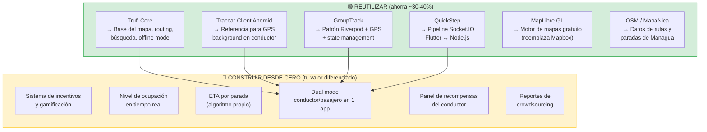

# 🔓 Proyectos Open Source Reutilizables — App Buses Managua

## Resumen: Sí, hay bastante código reutilizable

> [!TIP]
> Encontré **12+ proyectos open source** relevantes. No hay uno que haga exactamente lo que necesitás, pero combinando piezas de varios proyectos podés **ahorrarte un 30-40% del desarrollo**. Los más valiosos son **Trufi Core** (Flutter, hecho para transporte informal en países en desarrollo) y **Traccar** (GPS tracking maduro con 7.6K ⭐).

---

## 1. 🎯 Directamente Reutilizables (Ahorran semanas)

### 1.1 Trufi Core — ⭐ LA JOYA para tu proyecto

| | Detalle |
|:---|:---|
| **Repo** | [trufi-association/trufi-core](https://github.com/trufi-association/trufi-core) |
| **Stack** | Flutter / Dart (monorepo modular) |
| **Licencia** | MIT (libre para uso comercial) |
| **⭐ GitHub** | ~200+ stars |
| **Mantenimiento** | Activo — Trufi Association (ONG) |

**¿Qué es?** Framework Flutter para apps de transporte público en **países en desarrollo**. Fue creado exactamente para el mismo problema que vos: ciudades con transporte informal (minibuses, trufis, matatus) donde no hay datos oficiales.

**Ya desplegado en:** Cochabamba (Bolivia), Accra (Ghana), Addis Ababa (Etiopía) — contextos muy similares a Managua.

**🟢 Lo que podés reutilizar directamente:**

| Componente | Detalle | Ahorro estimado |
|:---|:---|:---|
| Mapa interactivo | MapLibre GL integrado, búsqueda, capas, POIs | ~2 semanas |
| Routing multimodal | OpenTripPlanner integrado (bus + caminar) | ~1 semana |
| Búsqueda de rutas | Online (Nominatim) + offline (asset-based) | ~1 semana |
| Soporte GTFS/GTFS-RT | Consumo de feeds en tiempo real | ~1 semana |
| Estructura modular | Monorepo con paquetes separables por feature | Arquitectura lista |
| Localización | Multi-idioma (agregar español) | Horas, no días |

**🔴 Lo que NO tiene (tenés que construir):**
- App de conductor (tracking GPS outbound)
- Sistema de incentivos/recompensas
- WebSocket para posiciones en vivo (usa GTFS-RT que es pull, no push)
- Nivel de ocupación/saturación
- Auth con SMS OTP

**Cómo usarlo:**
```bash
# Clonar y explorar la estructura
git clone https://github.com/trufi-association/trufi-core.git
cd trufi-core
# Explorar los paquetes disponibles
ls packages/
```

> [!IMPORTANT]
> **Recomendación:** Usá Trufi Core como **base para la app del pasajero**. Tiene el mapa, routing, y búsqueda ya resueltos. Agregale encima tu capa de tracking en vivo (Socket.IO) y la UI del conductor.

---

### 1.2 Traccar — El estándar de la industria para GPS tracking

| | Detalle |
|:---|:---|
| **Repo** | [traccar/traccar](https://github.com/traccar/traccar) |
| **Stack** | Backend: Java. Frontend: React + MapLibre. Mobile: Android/iOS nativo |
| **Licencia** | Apache 2.0 (libre para uso comercial) |
| **⭐ GitHub** | **7,600+ stars** |
| **Mantenimiento** | Muy activo — proyecto maduro (10+ años) |

**¿Qué es?** Plataforma completa de rastreo GPS. Soporta 2,000+ modelos de dispositivos GPS. Incluye dashboard web, apps móviles, geofencing, reportes, alertas.

**🟢 Lo que podés reutilizar:**

| Componente | Detalle | Ahorro |
|:---|:---|:---|
| Protocolo de comunicación GPS | Recepción y procesamiento de coordenadas de múltiples dispositivos | ~2 semanas |
| API REST de posiciones | Endpoints para consultar última posición, historial, reportes | ~1 semana |
| Dashboard web | Panel de administración con mapa, lista de vehículos | ~2 semanas |
| App Android tracker | App que envía GPS al servidor continuamente | ~1-2 semanas |
| Geofencing | Alertas cuando un vehículo entra/sale de una zona | ~1 semana |
| Reportes de viaje | Historial de rutas, velocidad, paradas | ~1 semana |

**🔴 Lo que NO tiene:**
- App de pasajero consumer-facing
- Nivel de ocupación de buses
- ETA para paradas específicas de ruta
- Sistema de incentivos
- Crowdsourcing de usuarios

**Cómo usarlo:**
```bash
# Backend Java
git clone https://github.com/traccar/traccar.git

# Frontend React
git clone https://github.com/traccar/traccar-web.git

# App Android (tracker)
git clone https://github.com/traccar/traccar-client-android.git
```

> **Opción interesante:** Podés usar Traccar **como tu backend de tracking** y construir la app Flutter del pasajero/conductor encima de su API. Esto te ahorra todo el pipeline de ingesta de GPS.

---

### 1.3 OneBusAway Vehicle Positions — GPS tracking para transporte informal

| | Detalle |
|:---|:---|
| **Repo** | [OneBusAway/vehicle-positions](https://github.com/OneBusAway/vehicle-positions) |
| **Stack** | Go (servidor) + Android (app tracker) |
| **Licencia** | Apache 2.0 |
| **⭐ GitHub** | Parte del ecosistema OBA (~600+ stars org) |

**¿Qué es?** Convierte un teléfono Android en un dispositivo GPS tracker y genera feeds GTFS-Realtime estándar. **Diseñado específicamente para transporte que NO tiene hardware AVL** — exactamente tu caso en Managua.

**🟢 Lo que podés reutilizar:**
- Lógica de la app Android para tracking GPS continuo
- Generación de feeds GTFS-RT (estándar de la industria)
- Servidor de ingesta de posiciones

**🔴 Limitaciones:**
- Es Go, no Node.js (pero la lógica es portable)
- No tiene frontend de pasajero
- Es más un componente que una app completa

---

## 2. 📐 Referencia de Arquitectura (para aprender el "cómo")

### 2.1 GroupTrack Flutter — Tracking en vivo con Riverpod + Socket.IO

| | Detalle |
|:---|:---|
| **Repo** | [canopas/group-track-flutter](https://github.com/canopas/group-track-flutter) |
| **Stack** | Flutter + Riverpod + Firebase |
| **Licencia** | Apache 2.0 |

**¿Por qué es útil?** Es la referencia perfecta para ver cómo integrar **Riverpod + GPS background + mapa en tiempo real** en Flutter. Incluye:
- State management con `flutter_riverpod` para location updates
- Background tracking que sobrevive al cierre de la app
- Geofencing integrado
- Compartir ubicación en tiempo real con otros usuarios

**🟢 Estudiar para copiar:** Arquitectura Riverpod para GPS, manejo de permisos, background service.

---

### 2.2 QuickStep App — Full-stack Flutter + Socket.IO + Node.js

| | Detalle |
|:---|:---|
| **Repo Frontend** | [aimelive/quickstep_app](https://github.com/aimelive/quickstep_app) |
| **Repo Backend** | [aimelive/quickstep-backend](https://github.com/aimelive/quickstep-backend) |
| **Stack** | Flutter + Google Maps + Socket.IO + Node.js/Express |
| **Licencia** | MIT |

**¿Por qué es útil?** Es un ejemplo completo de **Flutter ↔ Socket.IO ↔ Node.js** para tracking de ubicación en tiempo real. Tiene exactamente el pipeline que necesitás:
- App Flutter emite coordenadas GPS via Socket.IO
- Backend Node.js recibe y rebroadcast a otros clientes
- Mapa muestra posiciones en vivo

**🟢 Estudiar para copiar:** Integración Socket.IO con Flutter, estructura del backend Express.

---

### 2.3 RoadRadar — Vehicle tracking con roles (Admin/Driver)

| | Detalle |
|:---|:---|
| **Repo** | [Mourya-2602/RoadRadar_ISM](https://github.com/Mourya-2602/RoadRadar_ISM) |
| **Stack** | Flutter + Node.js/Express + MongoDB |
| **Licencia** | MIT |

**¿Por qué es útil?** Tiene el concepto de **roles (conductor/admin)** con dashboards diferentes — similar a tu modelo conductor/pasajero.

**🟢 Estudiar para copiar:** Lógica de roles, dashboard del conductor vs admin.

---

### 2.4 TruckTrack — Microservicios para fleet management

| | Detalle |
|:---|:---|
| **Repo** | [salimomrani/trucktrack](https://github.com/salimomrani/trucktrack) |
| **Stack** | Spring Boot + Kafka + WebSocket + React Native + Angular |
| **Licencia** | MIT |

**¿Por qué es útil?** Arquitectura de microservicios profesional con Kafka para procesamiento de eventos, OSRM para routing, Prometheus/Grafana para monitoreo. 

**🟢 Estudiar para aprender:** Cómo escalar a producción con microservicios (referencia para Fase 3+).

---

## 3. 🧰 Componentes Específicos Reutilizables

### 3.1 Herramientas y Librerías

| Componente | Proyecto | Link | Para qué |
|:---|:---|:---|:---|
| **Datos de rutas** | awesome-transit | [MobilityData/awesome-transit](https://github.com/MobilityData/awesome-transit) | Lista curada de TODAS las herramientas open source de transporte |
| **GTFS Bindings** | gtfs-realtime-bindings | [MobilityData/gtfs-realtime-bindings](https://github.com/MobilityData/gtfs-realtime-bindings) | Parsear datos GTFS-RT en JS/Python/Go |
| **Validador GTFS** | gtfs-realtime-validator | [MobilityData/gtfs-realtime-validator](https://github.com/MobilityData/gtfs-realtime-validator) | Validar feeds de datos de transporte |
| **Routing engine** | OpenTripPlanner | [opentripplanner.org](https://www.opentripplanner.org/) | Motor de planificación de viajes multimodal |
| **Routing alternativo** | MOTIS | [motis-project/motis](https://github.com/motis-project/motis) | Routing multimodal con soporte GTFS-RT |
| **Mapas open source** | MapLibre GL | [maplibre/maplibre-gl-js](https://github.com/maplibre/maplibre-gl-js) | Fork open source de Mapbox GL (gratis, sin API key) |

### 3.2 Datos de OpenStreetMap para Managua

| Recurso | Link | Para qué |
|:---|:---|:---|
| **Datos OSM de Nicaragua** | [download.geofabrik.de/central-america/nicaragua](https://download.geofabrik.de/central-america/nicaragua-latest.osm.pbf) | Datos geográficos completos de Nicaragua |
| **MapaNica** | [mapanica.net](https://mapanica.net/) | Proyecto comunitario de mapeo de Nicaragua en OSM |
| **Overpass Turbo** | [overpass-turbo.eu](https://overpass-turbo.eu/) | Consultar datos de OSM (rutas de bus, paradas) |

---

## 4. Tabla Comparativa: ¿Qué Proyecto Cubre Qué?

| Feature de tu app | Trufi Core | Traccar | OBA Vehicle | GroupTrack | QuickStep |
|:---|:---:|:---:|:---:|:---:|:---:|
| **Mapa interactivo (Flutter)** | ✅ | ❌ (React) | ❌ | ✅ | ✅ |
| **Rutas de bus en mapa** | ✅ | ❌ | ⚠️ | ❌ | ❌ |
| **Búsqueda de rutas** | ✅ | ❌ | ❌ | ❌ | ❌ |
| **GPS tracking conductor** | ❌ | ✅ | ✅ | ✅ | ✅ |
| **Tracking en vivo (mapa)** | ⚠️ (GTFS-RT) | ✅ | ⚠️ | ✅ | ✅ |
| **WebSocket/Socket.IO** | ❌ | ❌ (propio) | ❌ | ❌ (Firebase) | ✅ |
| **Riverpod state mgmt** | ❌ | ❌ | ❌ | ✅ | ❌ |
| **Roles (conductor/pasajero)** | ❌ | ✅ (admin/user) | ❌ | ❌ | ❌ |
| **ETA por parada** | ⚠️ (via OTP) | ❌ | ⚠️ | ❌ | ❌ |
| **Nivel de ocupación** | ❌ | ❌ | ❌ | ❌ | ❌ |
| **Sistema de recompensas** | ❌ | ❌ | ❌ | ❌ | ❌ |
| **Auth SMS OTP** | ❌ | ❌ | ❌ | ❌ | ❌ |
| **Modo offline** | ✅ | ❌ | ❌ | ❌ | ❌ |
| **Hecho para países en desarrollo** | ✅ | ⚠️ | ✅ | ❌ | ❌ |

---

## 5. Estrategia Recomendada de Reutilización



### Estimación de Ahorro

| Sin open source | Con open source | Ahorro |
|:---|:---|:---|
| ~370 horas-persona | ~230-260 horas-persona | **~30-40%** |
| ~14 semanas (2 devs) | **~9-10 semanas** (2 devs) | **4-5 semanas** |

### Lo que se ahorra más:
1. **Mapa + routing** (Trufi Core): ~3 semanas
2. **GPS background patterns** (GroupTrack/Traccar): ~1-2 semanas  
3. **Pipeline Socket.IO** (QuickStep): ~1 semana
4. **Datos geográficos** (OSM/MapaNica): ~1 semana

---

## 6. ⚠️ Consideraciones de Licencias

| Proyecto | Licencia | ¿Uso comercial? | Obligaciones |
|:---|:---|:---:|:---|
| Trufi Core | MIT | ✅ Sí | Incluir aviso de copyright |
| Traccar | Apache 2.0 | ✅ Sí | Incluir aviso de licencia y cambios |
| GroupTrack | Apache 2.0 | ✅ Sí | Incluir aviso de licencia |
| QuickStep | MIT | ✅ Sí | Incluir aviso de copyright |
| MapLibre GL | BSD-3 | ✅ Sí | Incluir aviso de copyright |
| OSM Data | ODbL | ✅ Sí | Atribución a OpenStreetMap |

> [!TIP]
> **Todas las licencias son permisivas** — podés usar este código en tu app comercial sin problemas. Solo debés incluir los avisos de copyright/licencia correspondientes (generalmente en un "Acerca de" o "Licencias" dentro de la app).

---

## 7. Próximos Pasos Sugeridos

1. **Clonar y explorar Trufi Core** — Entender la estructura del monorepo Flutter, probar la app en un emulador
2. **Clonar GroupTrack** — Estudiar cómo integra Riverpod + GPS background
3. **Clonar QuickStep (frontend + backend)** — Estudiar el pipeline Socket.IO completo
4. **Evaluar MapLibre vs Mapbox** — MapLibre es 100% gratis (fork de Mapbox). Podría ahorrarte los costos de Mapbox
5. **Descargar datos OSM de Managua** — Explorar qué rutas de bus ya están mapeadas en OpenStreetMap

> [!IMPORTANT]
> **MapLibre GL merece atención especial.** Es un fork open source de Mapbox GL que es **completamente gratis** — sin API key, sin limits, sin costos. Trufi Core ya lo usa. Esto eliminaría el costo de Mapbox del presupuesto.
