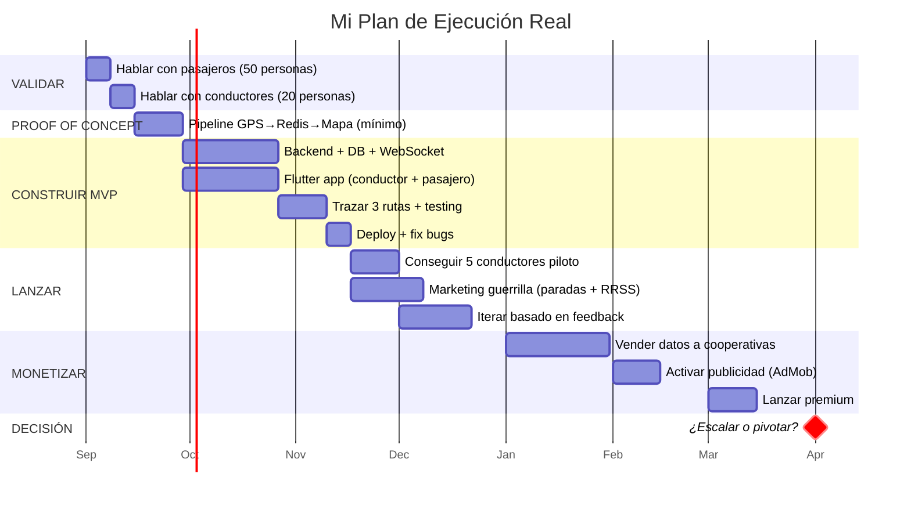

# 🎯 Si Yo Fuera Vos: De Inicio a Fin

> Este no es un plan técnico. Es un plan de **guerra**. Cómo yo ejecutaría esta idea paso a paso, con los recursos que vos tenés, en la realidad de Managua, sin romanticismo ni wishful thinking.

---

## La Mentalidad Antes de Empezar

```
Regla #1: No estás construyendo una app. Estás resolviendo un dolor.
Regla #2: El código es lo último que importa. Lo primero es la gente.
Regla #3: Si no podés hacer que 5 conductores usen la app, no importa
          si el código es hermoso.
Regla #4: Lanzá feo, lanzá rápido, arreglá después.
Regla #5: Cada semana sin usuarios reales es una semana perdida.
```

---

## FASE 0 — Validar en la Calle (Semana 1-2)

### Antes de escribir una sola línea de código

**Lo que haría:**

Agarraría un cuaderno y me subiría a los buses. Literalmente. Todos los días durante 2 semanas.

#### Semana 1: Hablar con pasajeros

- Me subo a 3-4 rutas diferentes por día (las más transitadas)
- Le pregunto a la gente sentada al lado mío:
  - *"¿Cuánto tiempo esperaste el bus hoy?"*
  - *"¿Cómo sabés cuándo viene el próximo?"*
  - *"¿Alguna vez se te pasó el bus o te subiste a uno lleno?"*
  - *"¿Si existiera una app que te diga dónde viene el bus, la usarías?"*
  - *"¿Tenés smartphone? ¿Qué apps usás para moverte?"*
- **Objetivo:** 50 conversaciones mínimo. Anotar todo.
- **Lo que busco:** Validar que el dolor es real, no solo mi suposición

#### Semana 2: Hablar con conductores

Esto es **lo más importante de todo el proyecto**. Me bajo en las terminales, en las paradas de inicio de ruta, donde los conductores descansan.

- *"¿Cómo es su día típico? ¿A qué hora empieza, a qué hora termina?"*
- *"¿Qué es lo que más le molesta de este trabajo?"*
- *"¿Usa el teléfono mientras maneja? ¿Qué apps tiene?"*
- *"¿Si existiera una app que le pagara por usarla mientras trabaja, qué pensaría?"*
- *"¿Cuánto tendría que ganarle extra al mes para que valga la pena?"*
- *"¿Quién toma las decisiones en su cooperativa? ¿Me puede presentar?"*
- **Objetivo:** 20 conductores + 2-3 líderes de cooperativa
- **Lo que busco:** Entender qué los motiva. No asumir — preguntar

#### ¿Qué podría descubrir que cambie todo?

| Descubrimiento posible | Impacto |
|:---|:---|
| "Aquí todo mundo usa WhatsApp, nadie quiere otra app" | Quizás el MVP es un bot de WhatsApp, no una app Flutter |
| "Los conductores no tienen data, solo wifi en su casa" | El modo offline es crítico. La app debe funcionar sin internet continuo |
| "El dueño del bus no es el conductor, el dueño decide" | Hay que convencer a los DUEÑOS, no a los conductores |
| "Ya nos pusieron GPS del gobierno y lo odiamos" | Hay resistencia. El framing tiene que ser "te beneficia a VOS", no "te rastreamos" |
| "Sí pagaría C$50/mes por no tener publicidad" | Validación directa del modelo premium |

> [!IMPORTANT]
> **Si después de 50 conversaciones con pasajeros y 20 con conductores, la respuesta general es "meh, no me interesa"** — parás aquí. Ahorraste 3 meses de tu vida. Pero te apuesto que no va a ser eso. El dolor es demasiado real.

**Costo de esta fase: $0. Tiempo: 2 semanas. Valor: infinito.**

---

## FASE 1 — Proof of Concept (Semana 3-4)

### El experimento más barato posible

No construyo la app todavía. Hago la prueba técnica más simple que demuestre que el pipeline funciona.

#### Lo que construyo en 2 semanas:

```
Teléfono A (conductor)          →  Servidor  →  Teléfono B (pasajero)
   GPS cada 15s                     Node.js        Punto moviéndose
   via Socket.IO                    + Redis          en un mapa
```

**Literalmente eso. Nada más.**

- Un script Node.js con Socket.IO (~100 líneas)
- Redis para guardar la última posición
- Una página web con un mapa (Leaflet + OpenStreetMap) que muestra un puntito moviéndose
- Una app Flutter mínima (o incluso solo una web app) que envía GPS

**No incluye:**
- ❌ Auth
- ❌ Base de datos
- ❌ Diseño bonito
- ❌ Rutas
- ❌ ETA
- ❌ Nada más

#### La prueba de fuego:

Le doy un teléfono a un conductor amigo (o me subo yo al bus) y abro el mapa en otro teléfono. Si veo el punto moverse por la ruta del bus en tiempo real con ≤5 segundos de delay — **la base técnica funciona.**

> Si esto no funciona bien (latencia alta, GPS inconsistente, se desconecta), lo descubro ahora y no después de 3 meses de desarrollo.

**Costo: $0 (free tiers). Tiempo: 2 semanas. Valor: confianza técnica total.**

---

## FASE 2 — MVP Real (Semana 5-12)

### Ahora sí, a construir — pero con foco brutal

Tengo validación de calle (Fase 0) y confianza técnica (Fase 1). Ahora construyo el MVP con **máximo 3 rutas piloto**.

#### ¿Qué rutas elijo?

Las que cumplan TODOS estos criterios:
1. **Alta demanda** — rutas donde siempre hay gente esperando
2. **Recorrido largo** — para que el tracking tenga más valor (esperar 45 min vs 10 min)
3. **Cooperativa receptiva** — una donde un líder me dio buena vibra en Fase 0
4. **Que yo conozca** — que pueda testear personalmente

#### División del trabajo (2 devs, 8 semanas)

```
Dev 1 (Backend + Infra):              Dev 2 (Flutter + UI):
─────────────────────────              ─────────────────────
Sem 5-6:                               Sem 5-6:
  - Fastify + PostgreSQL/PostGIS         - Proyecto Flutter base
  - Prisma schema + migrations           - Auth con Supabase (SMS OTP)
  - Docker Compose                       - Mapa con MapLibre GL
  - Auth middleware (JWT)                 - Cache de tiles offline
                                       
Sem 7-8:                               Sem 7-8:
  - WebSocket (Socket.IO) + Redis        - Modo conductor: GPS background
  - Ingesta GPS + batching               - Modo conductor: iniciar/terminar viaje
  - API REST (rutas, buses, paradas)     - Modo conductor: reportar ocupación
                                       
Sem 9-10:                              Sem 9-10:
  - Worker ETA (promedio histórico)      - Modo pasajero: tracking en vivo
  - Sistema de recompensas (básico)      - Modo pasajero: ETAs + ocupación
  - Seed data de 3 rutas reales         - Modo pasajero: lista de rutas
                                       
Sem 11-12:                             Sem 11-12:
  - Testing + fixes                      - Testing en dispositivos reales
  - Deploy a Railway                     - UI polish + modo offline
  - Monitoreo (Sentry)                   - Build para Android (APK)
```

#### Trazar las 3 rutas:

No espero datos de nadie. Agarro mi teléfono, me subo al bus con la app de GPS activa, y trazo la ruta yo mismo. Grabo el recorrido completo con coordenadas. Marco las paradas manualmente. Hago esto para las 3 rutas piloto.

**Herramienta:** OSMTracker (app gratuita para Android que graba tracks GPX) o la propia app del conductor en modo grabación.

#### ¿Qué NO incluyo en el MVP?

| Feature | ¿En el MVP? | ¿Por qué? |
|:---|:---:|:---|
| Tracking GPS en vivo | ✅ | Es el core |
| Mapa con bus moviéndose | ✅ | Es el core |
| ETAs básicas | ✅ | Diferenciador clave |
| Nivel de ocupación | ✅ | Diferenciador clave |
| Auth por SMS | ✅ | Necesario |
| Gamificación completa | ❌ | Empiezo con badges simples, no un sistema complejo |
| Pagos a conductores | ❌ | Lo registro internamente, pago manual al inicio |
| Notificaciones push | ❌ | Se agrega después, no es crítico para validar |
| iOS | ❌ | Solo Android. El 95%+ del mercado en Managua es Android |
| Panel admin web | ❌ | Uso directamente la DB o un admin simple |
| Chat en la app | ❌ | No agrega valor al core |
| Versión web | ❌ | Solo mobile |

**Costo: ~$50/mes infra + herramientas IA. Tiempo: 8 semanas.**

---

## FASE 3 — Lanzar y Sobrevivir (Semana 13-16)

### Los primeros 5 conductores

Esto es **lo más difícil y lo más importante del proyecto entero.** No es un problema técnico — es un problema de confianza humana.

#### Mi estrategia exacta:

**Paso 1: Conseguir 1 conductor aliado**

Vuelvo a los conductores que entrevisté en Fase 0. Busco al que mostró más interés. Le digo:

> *"Mirá, hice la app que te platiqué. Quiero que la probés por una semana. No te cuesta nada. Yo te pongo recarga de saldo [C$100-200] por la semana de prueba. Solo tenés que tener la app abierta mientras manejás. ¿Le entrás?"*

**Paso 2: Ese conductor convence a otros**

Los conductores confían en otros conductores, no en un developer con un teléfono bonito. Si el primer conductor tiene buena experiencia, él mismo va a decir en la terminal *"hey, hay un chavalo que te pone recarga por usar una app"*. Eso vale más que cualquier campaña de marketing.

**Paso 3: Escalar a 5, luego 10, luego 20**

| Semana | Conductores | Estrategia |
|:---|:---:|:---|
| 1 | 1-2 | Contacto personal, incentivo directo |
| 2 | 3-5 | Referidos del primero + visitas a terminales |
| 3 | 5-10 | Contacto con líder de cooperativa |
| 4 | 10-20 | Si hay tracción, la cooperativa lo adopta |

**Costo del incentivo inicial:** 5 conductores × C$200/semana × 4 semanas = C$4,000 (~$110 USD). **Eso es todo.** $110 para validar si los conductores van a usar tu app.

### Los primeros 100 usuarios (pasajeros)

Mientras consigo conductores, ataco la demanda:

#### Marketing con $0 de presupuesto:

1. **Paradas de bus** — Imprimo 50 flyers (cuesta C$200, ~$5.50) con un QR code y los pego en las paradas de las 3 rutas piloto
   - Texto: *"¿Cansado de esperar el bus sin saber cuándo viene? 📱 Descargá [NombreApp] y mirá dónde viene tu bus EN VIVO. Gratis."*

2. **Grupos de WhatsApp / Facebook** — Busco grupos de barrios que están en las rutas piloto. Publico:
   - *"Hola vecinos, hice una app que les muestra en tiempo real dónde viene el bus de la Ruta 110. Es gratis. [link]"*

3. **TikTok / Reels** — Grabo un video desde adentro del bus: *"Mirá, este es mi bus. Y mirá [muestra la app], así se ve en tiempo real dónde va. Ya nunca más esperés 40 minutos sin saber si viene."*

4. **Boca a boca** — Le digo a cada persona que conozco: amigos, familia, compañeros, vecinos.

**Objetivo: 100 descargas en la primera semana. 300 en el primer mes.**

> [!TIP]
> **No necesitás 10,000 usuarios para validar.** Si 50 personas usan la app todos los días y la recomiendan, tenés product-market fit. Si 1,000 la descargan y nadie vuelve, no lo tenés.

---

## FASE 4 — Monetizar (Mes 4-8)

### No monetizo hasta tener tracción real

**Mi regla:** No pongo publicidad ni cobro nada hasta tener al menos **2,000 MAU con 30%+ de retención semanal.** Antes de eso, toda monetización es prematura y puede espantar usuarios.

#### Orden de monetización:

```
Mes 4-5: 🎯 Conseguir 2,000+ MAU
          Solo crecimiento. Nada de monetización.

Mes 5-6: 📊 Vender datos a cooperativas/IRTRAMMA
          "Mirá, tengo datos reales de cómo se comportan tus rutas.
          ¿Querés un dashboard? $200/mes."
          → Esto no afecta la experiencia del usuario.

Mes 6-7: 📱 Publicidad contextual (Google AdMob)
          Banners no intrusivos.
          Con 2K-5K DAU → ~$150-500/mes.
          
Mes 7-8: ⭐ Premium (quitar ads + features extra)
          $0.99/mes o $9.99/año.
          3-4% de conversión → $60-200/mes.

Mes 8+:  🤝 Partnerships locales
          Negocios cerca de paradas pagan por visibilidad.
          $50-100/mes por negocio × 5-10 negocios.
```

---

## FASE 5 — Escalar o Pivotar (Mes 8-12+)

### Mido 3 métricas para decidir:

| Métrica | Si es BUENA → Escalar | Si es MALA → Pivotar |
|:---|:---|:---|
| **Retención D7** (% que vuelve en 7 días) | > 30% | < 15% |
| **Conductores activos diarios** | > 20 y creciendo | < 5 y estancado |
| **NPS** (recomendarías la app?) | > 40 | < 0 |

#### Si es BUENA → Escalar:

1. Expandir a más rutas en Managua (de 3 a 10 a todas)
2. Contratar 1 persona de soporte/community
3. Buscar inversión ángel local o aplicar a programas (APEN, BID Lab, Google for Startups LATAM)
4. Preparar expansión a León, Masaya, Chinandega

#### Si es MALA → Pivotar (no morir):

Opciones de pivote basadas en lo que descubrí:

| Pivote | Cuándo | Qué cambio |
|:---|:---|:---|
| **WhatsApp Bot** | Si nadie quiere descargar otra app | Mando ubicación del bus por WhatsApp. Menos sexy, pero más adopción |
| **B2G puro** | Si los pasajeros no usan pero los datos son valiosos | Dejo de ser app de consumo y vendo analytics a IRTRAMMA/cooperativas |
| **Solo conductores** | Si los conductores adoptan pero los pasajeros no | App de gestión para conductores: horas, rutas, ingresos. Monetizo con cooperativas |
| **Seguridad, no tracking** | Si el dolor real es seguridad, no tiempos de espera | App para reportar conductor temerario, acoso, robos. Monetizo con gobierno |

---

## El Calendario Completo



---

## Errores que NO Cometería

| Error común | Qué haría en su lugar |
|:---|:---|
| 🚫 Pasar 6 meses construyendo sin hablar con usuarios | ✅ Validar en la calle PRIMERO (Fase 0) |
| 🚫 Construir para iOS y Android desde el inicio | ✅ Solo Android. Punto |
| 🚫 Querer cubrir todas las rutas desde el día 1 | ✅ 3 rutas. Si funcionan, expando |
| 🚫 Diseñar una UI perfecta antes de lanzar | ✅ Lanzar feo pero funcional. Pulir después |
| 🚫 Poner publicidad desde el día 1 | ✅ Cero monetización hasta 2K+ MAU |
| 🚫 Gastar en oficina, logo, branding, tarjetas | ✅ $0 en eso. Todo en producto y usuarios |
| 🚫 Buscar inversión antes de tener tracción | ✅ Primero demostrar que funciona con $50/mes |
| 🚫 Tratar de convencer a IRTRAMMA desde el inicio | ✅ Construir la base de usuarios primero. Después IRTRAMMA viene a vos |
| 🚫 Competir con inDrive o Uber | ✅ No soy ride-hailing. Soy información pública. Complemento, no compito |
| 🚫 Construir todo desde cero | ✅ Reutilizar Trufi Core, MapLibre, Traccar patterns. 30-40% ya existe |

---

## El Costo Real de Todo Esto

| Fase | Duración | Costo |
|:---|:---|:---|
| Fase 0: Validación | 2 semanas | **$0** (pasajes de bus) |
| Fase 1: Proof of Concept | 2 semanas | **$0** (free tiers) |
| Fase 2: MVP | 8 semanas | **~$450** ($50/mes infra × 2 + $200 IA × 2) |
| Fase 3: Lanzamiento | 4 semanas | **~$170** ($50 infra + $110 incentivos + $10 flyers) |
| Fase 4: Primeros 4 meses post-launch | 16 semanas | **~$250** ($50/mes infra + SMS) |
| **TOTAL hasta tener validación real** | **~6 meses** | **~$870 USD** |

> [!IMPORTANT]
> **$870 dólares y 6 meses de tu tiempo.** Eso es lo que cuesta saber si esta idea funciona o no. Si funciona, tenés un negocio. Si no, aprendiste más en 6 meses que en 4 años de universidad, y solo perdiste $870.

---

## Mi Último Consejo

```
No te enamores de la app. Enamoráte del problema.

La app puede cambiar (WhatsApp bot, web app, otra cosa).
El problema no va a cambiar: 900,000 personas en Managua
necesitan saber dónde viene su bus.

Empezá mañana. No el lunes. No "cuando tenga tiempo".
Mañana subíte a un bus y empezá a hablar con la gente.

El código viene después. La gente viene primero.
```
