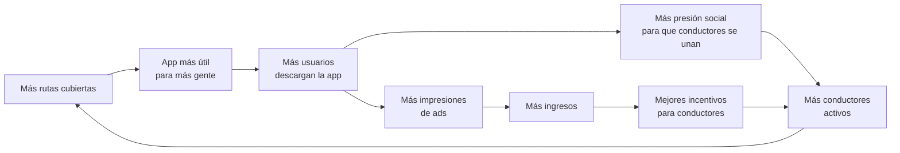
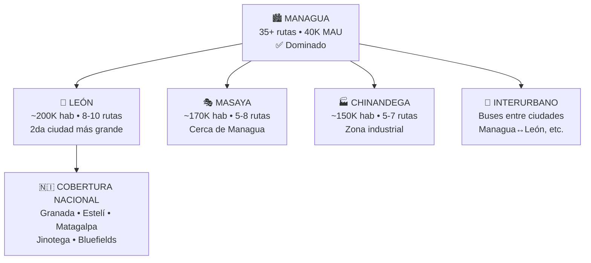
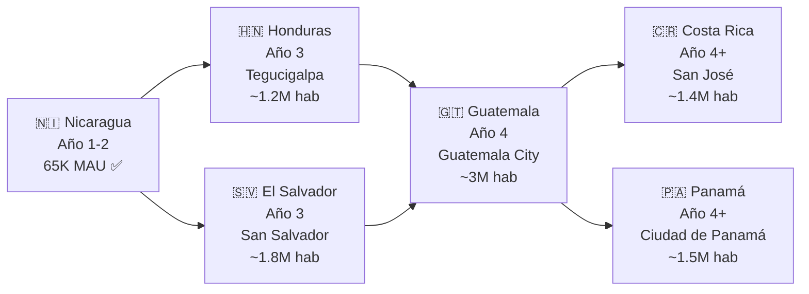
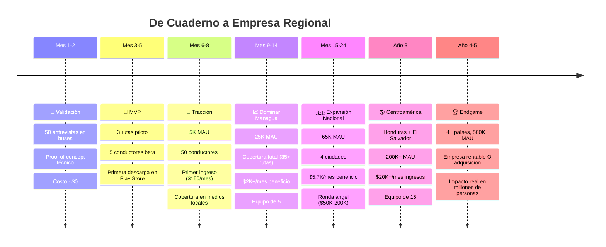

# 🚀 Si Yo Fuera Vos — Parte 2: Todo Salió Bien. ¿Y Ahora Qué?

> Estamos en **abril 2027**. Pasaron 7 meses desde que te subiste a un bus con un cuaderno. Esto es lo que pasó:

---

## Recap: Dónde Estamos (Mes 7)

```
┌──────────────────────────────────────────────────────────┐
│                    ESTADO ACTUAL                         │
│                                                          │
│  📱  5,200 MAU  •  1,800 DAU  •  38% retención D7       │
│  🚌  52 conductores activos en 8 rutas                   │
│  ⭐  4.3 estrellas en Play Store (87 reviews)            │
│  💰  $380/mes de ingresos (ads + 1 contrato B2G)        │
│  📉  $230/mes de costos (infra + incentivos)             │
│  📈  $150/mes de beneficio neto (primer mes positivo!)   │
│  👥  2 devs (los fundadores) + 0 empleados               │
│  🗞️  Artículo en un medio local: "La app que te dice    │
│      dónde viene tu bus en Managua"                      │
│  📊  NPS: 52 (excelente)                                 │
│                                                          │
│  Señales claras de product-market fit:                   │
│  • Usuarios piden más rutas todos los días               │
│  • Conductores nuevos llegan por referidos               │
│  • La gente en paradas de bus dice "¿ya tenés la app?"   │
│                                                          │
└──────────────────────────────────────────────────────────┘
```

> Lo que pasó es que encontraste algo raro: **un producto que la gente quiere, en un mercado que nadie está atendiendo, con costos ridículamente bajos.** Ahora la pregunta no es "¿funciona?" sino "¿hasta dónde puede llegar?"

---

## FASE 6 — Dominar Managua (Mes 7-12)

### Objetivo: Pasar de 8 rutas a TODAS las rutas. De 5K a 25K MAU.

#### 6.1 Expansión de rutas

Ya no trazo las rutas yo mismo. Ahora tengo conductores que lo hacen por mí.

| Estrategia | Cómo funciona |
|:---|:---|
| **"Ruta nueva = conductor nuevo"** | Cada vez que un conductor de una ruta no cubierta se une, su GPS traza la ruta automáticamente en los primeros 3 viajes |
| **Validación comunitaria** | Los pasajeros de esa ruta confirman/corrigen paradas via la app |
| **Auto-scaling de datos** | En vez de trazar manualmente, el sistema aprende las rutas de los datos GPS reales |

```
Mes 7:   8 rutas   →  Agrego 4 más (las que más piden los usuarios)
Mes 8:   12 rutas  →  Agrego 5 más
Mes 9:   17 rutas  →  Agrego 5 más  
Mes 10:  22 rutas  →  Agrego 5 más
Mes 11:  27 rutas  →  Las últimas que faltan
Mes 12:  35+ rutas →  COBERTURA TOTAL de Managua ✅
```

#### 6.2 El efecto de red empieza a funcionar



> A partir del mes 8-9, dejás de perseguir conductores. **Ellos te buscan a vos.** Porque sus colegas les dicen "instalá la app, te dan recargas", y los pasajeros les preguntan "¿por qué tu bus no sale en la app?"

#### 6.3 Evolución del producto (v1.5)

Features que agrego en estos meses, en orden de prioridad:

| # | Feature | Por qué ahora | Esfuerzo |
|:--|:---|:---|:---:|
| 1 | **Notificaciones push** | "Tu bus de la Ruta 110 sale en 5 minutos" — retención brutal | 1 semana |
| 2 | **Rutas favoritas** | El usuario abre la app y ve SUS rutas primero | 3 días |
| 3 | **Alertas de saturación** | "La Ruta 110 va llena, la 119 viene con espacio en 8 min" | 1 semana |
| 4 | **Compartir viaje** | Seguridad: "Mi mamá puede ver en qué bus voy" | 1 semana |
| 5 | **Modo oscuro** | Lo piden todos. Ahorra batería en AMOLED | 2 días |
| 6 | **Widget de Android** | Ver ETA del próximo bus SIN abrir la app | 1 semana |
| 7 | **Mejores ETAs con ML** | Suficientes datos históricos para entrenar un modelo simple | 2 semanas |

#### 6.4 Estado financiero al mes 12

```
INGRESOS (Mes 12):
  Publicidad (AdMob)              $1,800    (6K DAU × 5 imp × $1 eCPM)
  Datos B2G (IRTRAMMA + 2 coops) $1,100    (3 contratos)
  Premium (4% de 25K MAU)        $  750    (1,000 suscriptores × $0.75 avg)
  Partnerships locales            $  500    (5 negocios × $100)
  ─────────────────────────────────────────
  TOTAL                           $4,150/mes

COSTOS (Mes 12):
  Infraestructura                 $  270
  Incentivos conductores          $1,250    (50 conductores × $25 promedio)
  Marketing                       $  200
  SMS OTP                         $   50
  Herramientas (IA, monitoring)   $  200
  ─────────────────────────────────────────
  TOTAL                           $1,970/mes

═══════════════════════════════════════════
BENEFICIO NETO:                   $2,180/mes
ACUMULADO (12 meses):            ~$3,500 positivo (ya recuperé la inversión)
```

---

## FASE 7 — Construir el Equipo (Mes 10-14)

### Ya no podés hacer todo entre dos

Con 25K MAU, las demandas crecen. Necesitás ayuda, pero **no contratés como startup de Silicon Valley**. Contratá como negocio nicaragüense inteligente.

#### Primeras 3 contrataciones:

| # | Rol | Qué hace | Salario estimado | Cuándo |
|:--|:---|:---|:---|:---|
| 1 | **Community Manager / Soporte** | Responde usuarios en Play Store, WhatsApp, redes. Gestiona relación con conductores. Crea contenido en TikTok/IG | $300-400/mes | Mes 10 |
| 2 | **Dev Jr (pasante o part-time)** | Bugs, features menores, testing, trazar rutas nuevas | $250-400/mes | Mes 12 |
| 3 | **Ejecutivo comercial (part-time)** | Vende partnerships a negocios locales. Gestiona contratos B2G | $200 base + comisión | Mes 14 |

> [!TIP]
> **No contratés a nadie antes de necesitarlo desesperadamente.** Si vos podés manejar el soporte mientras crecés, esperá. Cada contratación prematura te come margen.

#### Estructura al mes 14:

```
  🏢 Equipo (5 personas, sin oficina)
  ├── Fundador 1 (Dev Backend + Producto + Estrategia)
  ├── Fundador 2 (Dev Mobile + UX + Datos)
  ├── Community Manager (Soporte + Redes + Conductores)
  ├── Dev Jr (Bugs + Features menores + QA)
  └── Comercial part-time (Ventas B2G + Partnerships)
  
  💰 Nómina total: ~$1,000-1,200/mes
  (Los fundadores aún viven de los beneficios del negocio)
```

---

## FASE 8 — Producto v2.0 (Mes 12-18)

### Features que transforman la app de "útil" a "indispensable"

Con cobertura total de Managua y datos de 6+ meses, ahora podés hacer cosas que nadie más puede:

#### 8.1 Planificador de viaje inteligente

```
Usuario: "Quiero ir de la UCA a Mercado Oriental"
App:     "Opción 1: Ruta 110 → sale en 3 min, llega en 22 min (viene con espacio)
          Opción 2: Ruta 117 → sale en 8 min, llega en 18 min (viene llena)
          Opción 3: Ruta 110 + transbordo 168 → llega en 25 min
          Recomendada: Opción 1 ⭐"
```

Esto te convierte en **el Google Maps del transporte público de Managua.** Nadie más puede hacerlo porque nadie más tiene los datos en tiempo real.

#### 8.2 Predicción de demanda

Con 6-12 meses de datos históricos:

- *"Los lunes a las 7:15am la Ruta 110 siempre va llena. Salí 10 minutos antes."*
- *"Hoy es feriado. La frecuencia será 30% menor."*
- *"Hay obras en la Pista Juan Pablo II. La Ruta 117 tarda 15 min más de lo normal."*

#### 8.3 Gamificación para conductores (v2)

```
🏆 LEADERBOARD SEMANAL
───────────────────────
1. 🥇 Carlos M. (Ruta 110)  — 48h activas, 98% puntualidad
2. 🥈 José R. (Ruta 117)    — 45h activas, 95% puntualidad  
3. 🥉 Pedro L. (Ruta 168)   — 43h activas, 97% puntualidad

🎖️ BADGES DESBLOQUEADOS
• "Madrugador" — Primer bus activo 5 días seguidos
• "Puntual" — 95%+ de puntualidad por 30 días
• "Popular" — Más de 500 pasajeros rastrearon tu bus esta semana
• "Veterano" — 6 meses consecutivos usando la app
```

#### 8.4 Reportes para cooperativas (Dashboard B2G)

```
📊 DASHBOARD — Cooperativa COTRAN-Norte
──────────────────────────────────────────
Buses activos hoy:           34 / 38
Cumplimiento de frecuencia:  78%
Ruta con más demanda:        Ruta 110 (12,400 usuarios/día)
Ruta con más saturación:     Ruta 117 (85% ocupación promedio)
Conductor más eficiente:     Carlos M. (Bus #2847)
Parada con más espera:       Parada UCA (avg 14 min)
Recomendación:               Agregar 1 unidad a Ruta 117 en hora pico
```

> Este dashboard se vende a $300-800/mes por cooperativa. Con 5 cooperativas = $1,500-4,000/mes solo de B2G.

---

## FASE 9 — Expansión Nacional (Mes 15-24)

### De Managua al país



#### Estrategia de expansión: Ciudad por ciudad

| Ciudad | Cuándo | Estrategia | Costo estimado |
|:---|:---|:---|:---|
| **León** | Mes 15-17 | Enviar al Community Manager 1 semana. Conseguir 3 conductores. Trazar rutas principales. El producto ya existe, solo hay que cargar datos nuevos | ~$200 (viaje + incentivos) |
| **Masaya** | Mes 17-19 | Mismo proceso. Masaya está tan cerca de Managua que casi se gestiona desde ahí | ~$150 |
| **Chinandega** | Mes 19-21 | Mismo proceso. Buscar aliado local (alguien de la ciudad que sea community manager part-time) | ~$300 |
| **Interurbano** | Mes 20-24 | Las rutas entre ciudades (Managua↔León, etc.) son las más demandadas para tracking. Un bus que tarda 2-3 horas es donde más valor tiene saber "¿dónde viene?" | ~$200 |

> [!TIP]
> **La belleza de tu modelo es que escalar a una ciudad nueva cuesta ~$200 y 1-2 semanas.** El producto ya está construido. Solo necesitás conductores y rutas nuevas. Esto es una ventaja brutal sobre competidores que necesitarían reconstruir desde cero.

#### Estado al mes 24:

```
┌──────────────────────────────────────────────────────────┐
│                    MES 24 — AÑO 2                        │
│                                                          │
│  📱  65,000 MAU total                                    │
│      • Managua: 45,000                                   │
│      • León: 8,000                                       │
│      • Masaya: 5,000                                     │
│      • Chinandega: 4,000                                 │
│      • Interurbano: 3,000                                │
│                                                          │
│  🚌  180 conductores activos                             │
│  🗺️  80+ rutas cubiertas en 4 ciudades                  │
│  👥  Equipo: 7 personas                                  │
│  ⭐  4.5 estrellas • 2,100+ reviews                     │
│                                                          │
│  💰  FINANZAS MENSUALES:                                 │
│      Ingresos:     $11,500                               │
│      Costos:       $ 5,800                               │
│      Beneficio:    $ 5,700/mes                           │
│      Acumulado:    $42,000+                              │
│                                                          │
│  📰  Cobertura en medios nacionales                      │
│  🏛️  IRTRAMMA te invita a presentar en reunión oficial  │
│  📧  3 fondos de inversión te han contactado             │
│                                                          │
└──────────────────────────────────────────────────────────┘
```

---

## FASE 10 — Fundraising (Mes 18-24)

### ¿Necesitás inversión? Depende de tu ambición.

#### Opción A: Bootstrapped (sin inversión) — "El negocio tranquilo"

```
Seguís creciendo orgánicamente.
$5,700/mes de beneficio = ~$68K/año.
Para 2 fundadores en Nicaragua, eso es un EXCELENTE ingreso.
Crecés más lento pero no rendís cuentas a nadie.
```

**Ventajas:** Libertad total, sin presión, sin dilución
**Desventajas:** Crecimiento más lento, vulnerable si aparece competencia

#### Opción B: Inversión ángel ($50K-200K) — "Acelerar sin perder control"

Con las métricas que tenés, podés levantar una ronda ángel:

| Lo que mostrás | Por qué importa |
|:---|:---|
| 65K MAU en un mercado sin competencia | Tracción demostrada |
| $11.5K MRR creciendo 15% mensual | Revenue real, no solo usuarios |
| $200 CAC (costo de adquirir una ciudad nueva) | Modelo de expansión ultra eficiente |
| Rentable desde el mes 14 | No sos un pozo sin fondo de cash |

**Dónde buscar:**
- **Caricaco Ventures** (fondo centroamericano)
- **BID Lab** (Banco Interamericano de Desarrollo — grants para innovación social)
- **Google for Startups LATAM** (programa de aceleración)
- **APEN Nicaragua** (Asociación de Productores y Exportadores — contactos)
- **Ángeles inversionistas locales** (empresarios nicaragüenses exitosos)

**Para qué usarías los fondos:**
| Uso | Monto | Impacto |
|:---|:---|:---|
| Expandir a 3 ciudades más | $15K | +20K MAU |
| Contratar 3 personas más | $30K (6 meses runway) | Producto + ventas + soporte |
| Marketing en ciudades nuevas | $10K | Acelerar adopción |
| Preparar expansión regional | $15K | Investigación + legal en Honduras/El Salvador |
| Buffer | $10K | Tranquilidad |

#### Opción C: Series A ($500K-2M) — "Conquistar Centroamérica"

Esto solo si decidís que querés ser **la app de transporte público de toda Centroamérica**. Necesitás:

- Presencia en 3+ países
- 200K+ MAU
- $30K+ MRR
- Equipo de 15-20 personas

> No pensés en esto ahora. Pero que sepas que la puerta existe.

---

## FASE 11 — Expansión Regional (Año 3-4)

### Centroamérica tiene el MISMO problema



| Ciudad | Población | Problema similar? | Dificultad de entrada |
|:---|:---|:---:|:---|
| **Tegucigalpa** 🇭🇳 | 1.2M | ✅ Idéntico (cooperativas, buses viejos, sin tracking) | Media — necesitás aliado local |
| **San Salvador** 🇸🇻 | 1.8M | ✅ Similar (microbuses, rutas informales) | Media — mercado más sofisticado |
| **Guatemala City** 🇬🇹 | 3M | ✅ Muy similar (camionetas, peligroso, sin datos) | Alta — ciudad más grande y compleja |
| **San José** 🇨🇷 | 1.4M | ⚠️ Parcial (más formal, ya hay algo de tracking) | Alta — más competencia |

#### Modelo de expansión: "Country Manager"

No intentes dirigir Honduras desde Managua. Para cada país:

1. Encontrá un **aliado local** (alguien que conozca el transporte de esa ciudad)
2. Ofrecele ser **Country Manager** con equity/participación
3. Él/ella consigue los primeros conductores y traza las rutas
4. Vos provéés la tecnología y el know-how
5. Revenue share: 70% para la empresa central, 30% para el country manager

> Este modelo es exactamente como Uber, inDrive y Rappi entraron a Centroamérica. No reinventés la rueda.

---

## FASE 12 — La Visión a 5 Años (Año 3-5)

### Los 3 posibles endgames

#### Endgame A: "La Empresa Regional Rentable" 💰

```
Año 5:
• 4 países, 500K+ MAU
• $50K-80K/mes de ingresos
• 25 empleados
• Rentable y creciendo
• Vos y tu socio ganan $5K-8K/mes cada uno
• Libertad financiera en Nicaragua
• Un negocio real que resuelve un problema real
```

**Probabilidad:** La más alta de las tres. Requiere ejecución consistente, no genialidad.

#### Endgame B: "La Adquisición" 🏷️

```
Quién podría comprarte:
• Moovit (Intel/Mobileye) — necesitan cobertura en Centroamérica
• inDrive — ya están en Managua, podrían querer datos de transporte público
• Cabify — expansión a transporte público
• Una empresa de logística regional
• Un banco centroamericano (datos de movilidad = datos de consumo)

Valuación potencial (con 500K MAU + $600K ARR):
• 8-15x revenue = $4.8M - $9M USD

Eso es life-changing money en Nicaragua.
```

**Probabilidad:** Media. Requiere que un comprador estratégico vea valor en tu base de datos y usuarios.

#### Endgame C: "La Plataforma de Movilidad" 🌎

```
La visión más ambiciosa:
• No solo tracking — pagos digitales del pasaje (tap-to-pay)
• No solo buses — integrar taxis, mototaxis, bicicletas
• No solo transporte — datos de movilidad para smart cities
• No solo Centroamérica — Colombia, Perú, Ecuador (mismos problemas)

Esto requiere Series A/B ($2-10M), equipo de 50+, 
y una ambición que va más allá de "resolver el bus en Managua."
```

**Probabilidad:** Baja pero no imposible. Moovit empezó exactamente así — una app de buses en Israel que terminó siendo comprada por Intel por $915M.

---

## Timeline Completo: Del Cuaderno al Endgame



---

## El Momento de la Verdad

```
┌──────────────────────────────────────────────────────────┐
│                                                          │
│  Todo este documento — los 5 análisis que hicimos,       │
│  las proyecciones, los repos open source, las fases —    │
│  no valen NADA si no hacés una cosa:                     │
│                                                          │
│                     EMPEZAR.                              │
│                                                          │
│  No necesitás más análisis.                              │
│  No necesitás más investigación.                         │
│  No necesitás permiso.                                   │
│                                                          │
│  Necesitás subirte a un bus mañana con un cuaderno       │
│  y preguntarle a la persona de al lado:                  │
│                                                          │
│  "¿Cuánto tiempo esperaste el bus hoy?"                  │
│                                                          │
│  Esa conversación es el primer paso de un viaje          │
│  que puede cambiar cómo se mueve una ciudad entera.      │
│                                                          │
│  $870 dólares. 6 meses. 1 cuaderno.                     │
│  Eso es lo que separa "tengo una idea" de                │
│  "construí algo que usan miles de personas."             │
│                                                          │
│  Hacelo.                                                 │
│                                                          │
└──────────────────────────────────────────────────────────┘
```

---

## 📋 Resumen de Documentos del Proyecto

Para referencia, estos son todos los análisis que preparamos juntos:

| # | Documento | Qué contiene |
|:--|:---|:---|
| 1 | **Análisis de Mercado** | Competidores, propuesta de valor, oportunidad |
| 2 | **Arquitectura Técnica** | Stack, DB, APIs, flujos de datos, deploy, costos |
| 3 | **Análisis de Complejidad** | Scorecard 7.2/10, riesgos, estimación de esfuerzo |
| 4 | **Modelo Financiero** | 3 escenarios, P&L, break-even, fuentes de ingreso |
| 5 | **Proyectos Open Source** | 12+ repos reutilizables, estrategia de ahorro 30-40% |
| 6 | **Por Qué Nadie Lo Ha Hecho** | 7 barreras, caso WhereIsMyTransport, ventana de oportunidad |
| 7 | **Si Yo Fuera Vos (Parte 1)** | Plan de ejecución Fase 0-5 (validación → monetización) |
| 8 | **Si Yo Fuera Vos (Parte 2)** | Continuación Fase 6-12 (escalar → endgame) |
